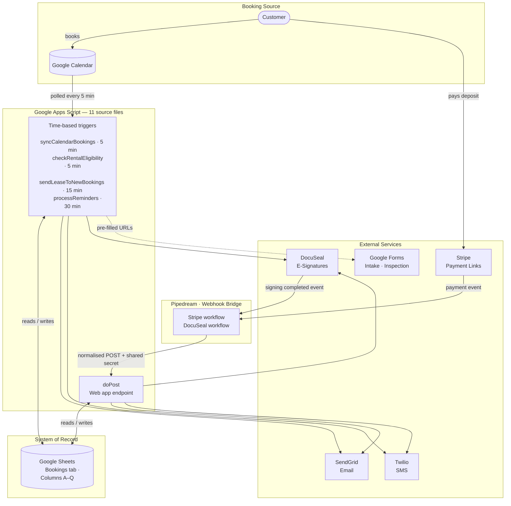
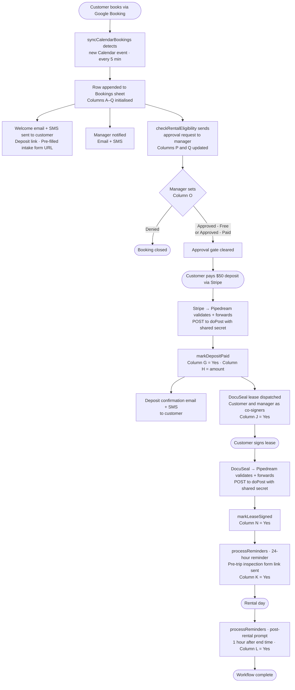

# Reliable Storage — Truck Rental Automation

> **Production system.** Runs the Bainbridge Island truck rental operation at Reliable Storage. Handles customer intake, deposit collection, e-signature, approval gating, and pre/post-rental reminders end-to-end.

---

## Table of Contents

1. [Project Overview](#project-overview)
2. [Business Impact](#business-impact)
3. [System Characteristics](#system-characteristics)
4. [Key Features](#key-features)
5. [Multi-Site Design](#multi-site-design)
6. [Architecture](#architecture)
7. [Booking Workflow](#booking-workflow)
8. [Repository Structure](#repository-structure)
9. [Security Model](#security-model)
10. [Production Challenges Solved](#production-challenges-solved)
11. [Future Roadmap](#future-roadmap)
12. [Deployment Notes](#deployment-notes)

---

## Project Overview

Reliable Storage is a Pacific Northwest storage and moving truck rental company. This repository contains the full backend automation system that handles every step of the rental workflow — from the moment a customer books a truck to the post-rental inspection follow-up — without requiring manual intervention from staff.

The system runs on Google Apps Script, triggered every five minutes against a Google Calendar booking feed. It writes to Google Sheets as its system of record, routes payments through Stripe via a Pipedream webhook bridge, collects e-signatures through DocuSeal, delivers transactional email through SendGrid, and sends SMS notifications through Twilio. All credentials live in Google Apps Script's Script Properties; no secrets appear in source code.

The v8 codebase is deployed in production for the Bainbridge location. The repository is structured for multi-site expansion: configuration is driven by a `SITES` array and a `GLOBAL` object, and adding a new location requires no logic changes — only a new `SITES` entry and a set of Script Properties.

---

## Business Impact

Before this system, booking follow-up was handled manually. Staff had to remember to send deposit reminders, track which customers had signed their lease, and coordinate pre-trip inspection instructions for each pickup. Missed steps led to customers arriving without a paid deposit or a signed rental agreement.

This automation closes every gap in that workflow:

- **Deposit capture rate improved** — customers receive a payment link by SMS and email within minutes of booking; a 24-hour reminder repeats the prompt if the deposit has not cleared
- **Lease completion enforced before pickup** — DocuSeal is triggered automatically on deposit confirmation; the 24-hour reminder flags unsigned leases to both the customer and the manager
- **Unauthorized rentals prevented** — a manager approval gate blocks the workflow until column O is manually set; no lease sends without approval
- **Manager has full email visibility** — every customer-facing email is silently BCC'd to the site manager, giving her a real-time audit trail without generating duplicate inbox threads
- **Zero manual scheduling** — 24-hour pickup reminders and post-rental inspection requests fire automatically based on calendar start and end times; no cron job configuration required

---

## System Characteristics

**Runtime:** Google Apps Script (V8 JavaScript engine, server-side). No traditional server infrastructure. The script runs inside Google's managed execution environment, triggered by time-based schedules and HTTP requests.

**Database:** Google Sheets. Each booking occupies one row across 17 columns (A–Q). State flags written to individual cells serve as the idempotency mechanism for outbound communications. Reads and writes use the Spreadsheet API via `SpreadsheetApp`.

**Execution model:** Two independent paths — a trigger path (polling, scheduled) and a webhook path (event-driven, via Pipedream). Both read from and write to the same Sheets system of record.

**Hard constraints inherited from the platform:**
- Maximum trigger execution time: 6 minutes
- Minimum trigger scheduling interval: 5 minutes
- Maximum triggers per Apps Script project: 20
- No built-in IP allowlist for web app endpoints

**Source structure:** 11 `.js` files in `src/`, all sharing one flat global scope when deployed. No module system, no imports, no exports. Each file contains one logical group of functions. Load order between files is irrelevant because no file has top-level code that depends on another file's declarations at parse time — all cross-file references are resolved at call time.

**Configuration:** All API keys, webhook secrets, calendar IDs, and form URLs are loaded from Apps Script Script Properties at runtime. Rotating a credential requires one console update, no redeployment.

---

## Key Features

**Calendar-driven booking sync**
A time-based trigger polls the Google Calendar every five minutes and appends new bookings to the Bookings sheet. Customer name, email, phone number, and second driver email are extracted from the structured HTML description written by Google Booking — no manual data entry required.

**Approval-gated workflow with a reminder state machine**
The manager must explicitly approve each rental by setting a dropdown in column O (`Approved - Free`, `Approved - Paid`, or `Denied`). The script never writes to that column. Approval state is tracked in columns P (last notification timestamp) and Q (reminder count), which drives a four-branch state machine: initial request → timed reminders → admin escalation → permanent silence. This design replaced an earlier pattern that caused a reminder storm every five minutes.

**Idempotent message delivery**
Every outbound message type has a corresponding sentinel flag in the Bookings sheet. The flag is written and flushed to the spreadsheet *before* the external API call is made. If a trigger re-fires mid-execution, the second invocation reads the flag as set and skips the row — preventing duplicate messages even under concurrent trigger overlap.

**Webhook bridge via Pipedream**
Stripe payment events and DocuSeal signing events are received by Pipedream, which validates upstream signatures, normalises payloads into a consistent shape, injects a shared secret, and forwards to the Apps Script web app endpoint. Apps Script never parses raw Stripe or DocuSeal payloads directly.

**Shared-secret webhook authentication**
`doPost` validates `data.secret` against `WEBHOOK_SHARED_SECRET` in Script Properties before reading any sheet data or triggering any side effect. Requests with a missing or incorrect secret return `{ received: false }` immediately. The endpoint is deployed as "Anyone" (required for Pipedream), but the shared secret is the authentication layer.

**Manager BCC on all customer-facing email**
`sendEmailHtml` automatically adds the site manager as a BCC recipient on every outbound customer email. Emails already addressed to the manager or admin are excluded. The BCC is invisible to customers, generates no duplicate inbox threads, and gives the manager a real-time audit trail of customer communications. DocuSeal lease emails are excluded because the manager already receives them as a co-signer.

**Configuration-driven, no hardcoded credentials**
Every API key, webhook secret, form URL, and calendar ID is loaded from Script Properties at runtime. Rotating a credential requires updating one value in the Apps Script console — no code change, no redeployment.

**Defensive date handling**
A `toDate(value, label)` helper wraps every call to `Utilities.formatDate`. If a Calendar event start time arrives as a non-Date value, the helper throws an error that names the label, the bad value, and its JavaScript type — replacing the opaque platform error `Invalid argument: date. Should be of type: Date` with a diagnostic message that identifies the offending event in the execution log.

---

## Multi-Site Design

The system is architected to support multiple Reliable Storage locations from a single codebase. Adding a new site requires no changes to business logic.

### Configuration split

Two objects replace the original flat `CONFIG`:

- **`GLOBAL`** holds everything that is genuinely shared: Twilio account credentials, SendGrid API key, DocuSeal key and template IDs, Stripe credentials, shared form URLs, the webhook secret, and policy constants (reminder cadence, days ahead to scan, etc.)
- **`SITES`** is an array of per-location objects, each holding the fields that differ by site:

```javascript
const SITES = [
  {
    id:           'bainbridge',
    label:        'Bainbridge',       // must match Google Form Site dropdown exactly
    sheetName:    'Bookings',
    calendarId:   PROPS.BAINBRIDGE_CALENDAR_ID,
    managerEmail: 'site@example.com',
    managerPhone: '+12065550100',
    fromEmail:    'site@example.com',
    replyToEmail: 'site@example.com',
    twilioFrom:   '+12065550111',
  },
  // { id: 'poulsbo', label: 'Poulsbo', ... }
];
```

### Per-site trigger isolation

Apps Script triggers cannot accept arguments, so a single trigger iterating over all sites would share one six-minute execution budget. Instead, each site gets its own named wrapper functions registered as independent triggers:

```javascript
function syncCalendarBookings_Bainbridge() {
  syncCalendarBookingsForSite(getSiteById('bainbridge'));
}
function syncCalendarBookings_Poulsbo() {
  syncCalendarBookingsForSite(getSiteById('poulsbo'));
}
```

Each wrapper runs in its own execution context with its own budget. A slow API response at one site cannot starve another site's execution.

### Webhook routing

Stripe and DocuSeal payloads carry no site identifier. For Milestone 1, `doPost` searches all sites' sheets for a row matching the incoming customer email and routes to the first match. The known edge case — the same email appearing at two sites simultaneously — is documented and accepted as a Milestone 1 constraint.

For v9, each Pipedream workflow will append `siteId` and `eventId` to its outbound payload. `doPost` will route directly without any cross-sheet search.

### Onboarding a new location

1. Add an entry to the `SITES` array
2. Set Script Properties with the site's prefix (e.g., `POULSBO_CALENDAR_ID`)
3. Create a new sheet tab for the site
4. Register the site's trigger wrappers in `setupTriggers()` and re-run it
5. Confirm the Google Form Site dropdown includes the new `site.label` value exactly

No engine functions change. No webhook routing changes. No Pipedream workflow changes.

---

## Architecture

The system has two distinct execution paths that converge on Google Sheets as the shared system of record.

The **trigger path** runs on time-based schedules inside Google Apps Script. It polls Google Calendar for new bookings, processes each row in the Bookings sheet, and dispatches outbound communications via Twilio, SendGrid, and DocuSeal.

The **webhook path** is event-driven. Stripe and DocuSeal post events to Pipedream, which validates upstream signatures, normalises each payload, injects the shared secret, and forwards to the Apps Script web app endpoint (`doPost`).



**Google Sheets is the system of record.** Every booking occupies one row (columns A–Q). State flags are written before any outbound API call, so a trigger re-firing mid-execution cannot produce duplicate messages.

**Pipedream is the webhook bridge.** It decouples external event formats from Apps Script and handles upstream signature verification. The shared secret it injects is the only trust mechanism Apps Script requires from inbound requests.

**SMS messages are shortened via Bitly** before dispatch through Twilio, transparently inside `sendSms`, to stay within carrier character limits.

---

## Booking Workflow

Each booking progresses through four phases: intake, approval, payment and lease, and reminders. All state transitions are written to the Bookings sheet before external calls are made.



**Key implementation notes:**

- `syncCalendarBookings` extracts customer name, email, phone, and second driver email from the structured HTML in the Calendar event description, not from the event title
- Column O (`Rental Approved`) is enforced by data-validation dropdown with three permitted values; the script never writes to this column
- The 24-hour reminder fires when `hoursUntilStart` is between 0 and 26, giving a window that covers the 30-minute trigger polling interval; message content adapts based on whether the deposit has cleared and the lease has been signed
- The post-rental inspection prompt fires when `hoursAfterEnd >= POST_RENTAL_HOURS` (currently 1 hour); end time defaults to start time + 4 hours if not set in the Calendar event
- The manager receives a silent BCC on every customer-facing email via `sendEmailHtml`; emails addressed directly to the manager or admin are excluded

---

## Repository Structure

```
.
├── src/
│   ├── Code.js                       # File map comment only — no executable code
│   ├── Config.js                     # PROPS and CONFIG — all credentials and constants
│   ├── Forms.js                      # buildIntakeUrl, buildInspectUrl
│   ├── DocuSeal.js                   # sendLeaseViaDocuSeal
│   ├── Webhooks.js                   # doPost, doGet, markDepositPaid,
│   │                                 # markLeaseSigned, verifyStripeSignature,
│   │                                 # computeHmacSha256
│   ├── CalendarSync.js               # syncCalendarBookings  (Engine 1)
│   ├── Leases.js                     # sendLeaseToNewBookings (Engine 2)
│   ├── Approval.js                   # checkRentalEligibility (Engine 2b)
│   ├── Reminders.js                  # processReminders       (Engine 3)
│   ├── Notifications.js              # sendSms, sendEmailHtml, alertAdmin,
│   │                                 # shortenUrl, shortenUrlsInText
│   ├── Helpers.js                    # getSheet, field extractors, toDate,
│   │                                 # formatDate, formatDateForForm, formatDateTime
│   └── Setup.js                      # setupTriggers
│
├── archive/                          # git-ignored — local reference only
│   ├── v7-original.js                # Baseline before v8 changes
│   └── current-production-from-andrew.js  # Andrew's latest deployed version
│
├── docs/
│   ├── setup-notes.md                # Script Properties, deployment steps,
│   │                                 # Pipedream workflows, webhook secret setup
│   ├── architecture-proposal.md      # Multi-site design decisions and
│   │                                 # migration strategy
│   ├── testing-plan.md               # 8-test Bainbridge flow checklist
│   │                                 # with gate structure
│   └── production-diff-summary.md    # v7 → v8 change analysis
│
├── .gitignore                        # Excludes archive/*.js, secrets, .env
├── CLAUDE.md                         # Context for AI-assisted development
└── README.md
```

**Source file conventions**

All eleven `src/*.js` files are deployed into a single Google Apps Script project where they share one global scope — no import or export statements, no module system. Functions defined in one file call functions defined in another freely. `Config.js` is the only file with executable top-level code (`const PROPS` and `const CONFIG`). All other files contain only function declarations, which are not evaluated until called. Load order between files is therefore irrelevant.

**Archive policy**

`archive/` is listed in `.gitignore`. Production source snapshots are stored locally for diff reference and rollback but are not committed to version history. `archive/v7-original.js` predates this policy and remains tracked.

---

## Security Model

### Web app access: "Anyone" with a shared secret

The Apps Script web app must be deployed with **Who has access: Anyone** because Pipedream's outbound IP ranges are not fixed and cannot be allowlisted at the Apps Script layer. This setting means any HTTP client can reach `doPost`. It does not mean any request is trusted.

Trust is established by a shared secret. Every POST body must contain a `secret` field that matches `WEBHOOK_SHARED_SECRET` in Script Properties:

```javascript
const expectedSecret = PROPS.WEBHOOK_SHARED_SECRET;
if (!expectedSecret) {
  throw new Error('Setup error: WEBHOOK_SHARED_SECRET is not set in Script Properties.');
}
if (!data.secret || data.secret !== expectedSecret) {
  Logger.log('doPost rejected: missing or invalid secret.');
  return ContentService.createTextOutput(JSON.stringify({ received: false }))
    .setMimeType(ContentService.MimeType.JSON);
}
```

This check executes before any sheet read, row update, email, SMS, or DocuSeal call. Rejected requests return HTTP 200 with `{ received: false }` — returning a non-200 would cause Pipedream to enter a retry loop on what is a permanent authentication failure.

The secret is a 64-character hex string (`openssl rand -hex 32`) stored in Apps Script Script Properties and each Pipedream workflow's environment variables. It never appears in source code.

### Pipedream as trust boundary

Pipedream is responsible for receiving raw webhook payloads from Stripe and DocuSeal, validating upstream signatures, filtering to the relevant event types, normalising the payload, and injecting the shared secret before forwarding to Apps Script.

This division of responsibility keeps `doPost` simple and decouples it from provider-specific payload formats. If Stripe or DocuSeal changes their event envelope, only the Pipedream workflow needs updating — no Apps Script redeployment, no new deployment URL to re-register with providers.

`verifyStripeSignature` and `computeHmacSha256` are present in `Webhooks.js` but are not currently called from `doPost`. They are retained as forward-looking infrastructure for secondary verification if the threat model changes.

### Credentials in Script Properties

No API key, webhook secret, calendar ID, or form URL appears in source code. Every value of that kind is loaded at runtime from Script Properties. Rotating a credential requires one update in the Apps Script console — no code change, no redeployment.

The two hardcoded values (`TWILIO_NUM` and `MANAGER_PHONE`) are structural constants, not rotatable secrets. They are documented explicitly in the codebase as intentional.

`archive/*.js` is listed in `.gitignore`. Production source snapshots received from the operator are excluded from version history.

### Column O: manager-controlled approval gate

Column O (`Rental Approved`) is never written by the script. It accepts exactly three values enforced by Google Sheets data-validation: `Approved - Free`, `Approved - Paid`, `Denied`. Only the site manager sets this value manually. The script's role is to request the decision and wait for it. Writing any script-controlled value to column O — as an earlier version did — caused the five-minute trigger to re-evaluate the row on every run and re-send the approval request email indefinitely.

### Idempotent flag writes

Sentinel flags for each message type are written and flushed to the spreadsheet before the outbound API call:

```javascript
// *** WRITE FLAG FIRST — before anything can throw ***
sheet.getRange(i + 1, 11).setValue('Yes');
SpreadsheetApp.flush();
// External calls happen after this point
```

A concurrent trigger invocation reading the row after the flush sees the flag as set and skips the row. A failed API call after the write leaves the flag set with the message undelivered — this is the accepted tradeoff, as a missed reminder is recoverable and a repeated reminder storm is not.

### Known limitation: cross-site webhook routing

`doPost` currently identifies which site a payment or signing event belongs to by searching all sites' sheets for a row whose email matches the incoming address. If the same customer email appears at two sites simultaneously with an unpaid deposit, the payment could be credited to the wrong row. This is accepted as a Milestone 1 constraint. The matched site ID is logged on every `doPost` call.

**Planned v9 fix:** Pipedream workflows will append `siteId` and `eventId` to the outbound payload. `doPost` will route directly without any cross-sheet search. No structural Pipedream change required — only an additional field in each workflow's final POST step.

---

## Production Challenges Solved

### 1. Approval reminder storm

**Problem:** The site manager received one approval request email every five minutes for every pending rental, indefinitely.

**Root cause:** The script wrote `Pending` to column O when the first approval request was sent. The five-minute trigger read `Pending` on its next run, did not recognise it as a terminal state, and sent another email. Column O was simultaneously the manager's decision field and the script's state-tracking field — two uses the column was never designed to support at the same time.

**Solution:** Column O became strictly manager-only. Notification state moved to columns P (last notification timestamp) and Q (reminder count), driving a four-branch state machine: initial request → timed reminders → admin escalation → permanent silence. P and Q are only written on successful send, so failed API calls automatically retry on the next trigger run.

**Tradeoffs:** The escalation to `ADMIN_EMAIL` and permanent-skip behaviour means a booking that is never decided disappears from the reminder queue. This is intentional — the escalation transfers responsibility from the script to a human.

---

### 2. Duplicate message delivery

**Problem:** Customers and managers intermittently received the same email or SMS twice — deposit confirmations, 24-hour reminders, post-rental prompts.

**Root cause:** Apps Script time-based triggers are not exclusive. When a trigger's execution time approaches the scheduling interval, a second invocation starts before the first finishes. Both read the same row state, both conclude the message has not been sent, and both dispatch. A secondary cause: an API call that succeeded before a script timeout left no flag written, so the next run resent the message.

**Solution:** Write the sentinel flag and call `SpreadsheetApp.flush()` before any external API call. A concurrent trigger invocation reading the row after the flush sees the flag as set and skips. The write ordering ensures the flag is committed to the spreadsheet before any outbound action is attempted.

**Tradeoffs:** A failed API call after the flag write leaves the flag set with the message undelivered. This is the accepted failure mode: a missed notification is a recoverable customer service problem; a notification storm is not.

---

### 3. Silent date parsing failures

**Problem:** Calendar sync failed intermittently with `Invalid argument: date. Should be of type: Date`. The error named no value, no variable, and no event. Debugging required manually correlating execution timestamps with the booking calendar.

**Root cause:** `Utilities.formatDate()` throws this error when its first argument is not a native `Date` object. Under certain conditions, `event.getStartTime()` returned a value that failed an `instanceof Date` check inside the Apps Script runtime. The platform error message is a generic type guard with no diagnostic information.

**Solution:** A `toDate(value, label)` helper wraps every call to `Utilities.formatDate`. If the value is not a valid Date, it attempts coercion via `new Date(value)`. If that also fails, it throws an error naming the label (which formatter was called), the JSON-serialised bad value, and its JavaScript type:

```javascript
function toDate(value, label) {
  if (value instanceof Date && !isNaN(value.getTime())) return value;
  const d = new Date(value);
  if (isNaN(d.getTime())) {
    throw new Error('Expected a Date for ' + (label || 'value') +
      ' but got ' + JSON.stringify(value) + ' (type ' + typeof value + ')');
  }
  return d;
}
```

**Tradeoffs:** The coercion path accepts strings in formats JavaScript's `Date` constructor recognises, but its behaviour is locale- and runtime-dependent. The helper makes failures visible and locatable; it does not eliminate the upstream ambiguity in how Calendar API returns start times.

---

### 4. Manager email visibility

**Problem:** The site manager had no visibility into what customers were receiving. When a customer called with a question, the manager had to ask them to read the email back.

**First approach considered:** Send a separate copy to the manager after each customer send. Rejected because the manager already receives direct emails from the script (approval requests, booking notifications), and adding a parallel copy thread would create redundant noise and would not extend to SMS — Twilio rejects a message where `To` equals `From`.

**Solution:** Add the manager as a BCC recipient in SendGrid's `personalizations` block inside `sendEmailHtml`. The guard excludes emails already addressed to the manager or admin, preventing duplicate copies on notifications she is already the primary recipient of:

```javascript
const personalization = { to: [{ email: toEmail }] };
if (CONFIG.MANAGER_EMAIL &&
    toEmail !== CONFIG.MANAGER_EMAIL &&
    toEmail !== CONFIG.ADMIN_EMAIL) {
  personalization.bcc = [{ email: CONFIG.MANAGER_EMAIL }];
}
```

Centralising this in `sendEmailHtml` means all future customer-facing emails — including those added during multi-site expansion — automatically include the BCC.

**Tradeoffs:** DocuSeal lease emails are sent by DocuSeal directly and are not routed through `sendEmailHtml`, so they are not BCC'd. The manager receives the DocuSeal signing request as a co-signer on every lease, which preserves visibility through a different mechanism. In the multi-site refactor, the BCC guard must compare against `site.managerEmail`, not a global value — this is the highest-risk substitution in the entire refactor.

---

### 5. Webhook endpoint trust

**Problem:** The Apps Script web app endpoint was reachable by any HTTP client. A correctly formatted POST body would trigger sheet writes, emails, SMS messages, and DocuSeal submissions with no authentication.

**Root cause:** The "Anyone" access setting is required for Pipedream to reach the endpoint; there is no IP allowlist mechanism at the Apps Script layer. The original design relied implicitly on the obscurity of the deployment URL.

**Solution:** A shared secret is injected into every Pipedream POST body. `doPost` validates it as the first action before reading any sheet data. Rejected requests return HTTP 200 with `{ received: false }` to prevent Pipedream from entering a retry loop on a permanent authentication failure.

**Tradeoffs:** The string comparison uses `!==`, which is not timing-safe. A constant-time comparison equivalent is not available in the Apps Script runtime. For this threat model — a shared secret over a high-latency HTTP endpoint — timing attacks are not a realistic concern. If that assessment changes, the check should move into Pipedream, which has access to Node.js crypto primitives.

---

### 6. Apps Script execution budget

**Problem:** Apps Script enforces a six-minute execution limit per trigger invocation. A multi-site design that used `SITES.forEach(site => fn(site))` inside a single trigger function would scale linearly with the number of sites. An API timeout at one site would eat into the budget for all subsequent sites.

**Root cause:** Trigger functions in Apps Script cannot accept arguments, which makes parameterisation impossible without a wrapper. The natural instinct — iterate over all sites inside one trigger — is bounded by the six-minute ceiling.

**Solution:** Each site gets its own named wrapper functions registered as independent triggers:

```javascript
function syncCalendarBookings_Bainbridge() {
  syncCalendarBookingsForSite(getSiteById('bainbridge'));
}
```

Each wrapper runs in its own execution context with its own six-minute budget. A slow external API response at one site cannot delay or terminate processing at another.

**Tradeoffs:** Apps Script allows a maximum of 20 triggers per project. At four triggers per site, this supports up to five sites before hitting the platform quota. Beyond five, the trigger strategy would need to change — potentially to a dispatcher model that reads a queue rather than invoking per-site functions directly.

---

### 7. Pipedream as the normalisation layer

**Problem:** Stripe and DocuSeal each send webhook payloads in different formats. Stripe wraps payment events in a nested envelope; DocuSeal sends one event per signer per submission, including intermediate states (viewed, partially signed, manager signed) that must be filtered before the relevant completion event is processed.

**Root cause of the original approach:** Handling raw payload parsing in `doPost` would require the function to implement Stripe's HMAC-SHA256 signature verification, parse two distinct payload schemas, and filter DocuSeal events by completion status and signer role. It would also mean that any change to a provider's event envelope required an Apps Script redeployment — which generates a new deployment URL that must be re-registered with each provider.

**Solution:** Pipedream was introduced as the normalisation layer. Each provider has its own workflow that receives the raw payload, validates the upstream signature, filters to the relevant event, extracts the fields Apps Script needs, injects the shared secret, and forwards a minimal consistent payload. Apps Script receives only two shapes regardless of how many upstream providers are involved.

Adding a new payment or signature provider requires a new Pipedream workflow pointed at the existing Apps Script endpoint — no Apps Script changes, no redeployment, no new URL to register.

**Tradeoffs:** Pipedream is now in the critical path for payment and signing events. An outage means those events do not reach Apps Script until Pipedream recovers. This dependency is treated the same as depending on Twilio or SendGrid — as external infrastructure with its own SLA, not something this codebase controls. `verifyStripeSignature` and `computeHmacSha256` are retained in the codebase as a forward path for secondary verification in Apps Script if the dependency model changes.

---

## Future Roadmap

**v9 — Pipedream payload metadata**
Add `siteId` and `eventId` to each Pipedream workflow's outbound POST body. `doPost` routes directly to the correct site's sheet without any cross-sheet email search. No structural Pipedream workflow change required — only an additional field in each workflow's final step.

**Multi-site production cutover**
Add a second site to the `SITES` array, register its per-site trigger wrapper functions in `setupTriggers()`, provision Script Properties with the site's prefix, and create its sheet tab. The first cutover target is Poulsbo.

**Google Form Site dropdown**
Andrew adds a Site dropdown to the shared intake and inspection forms. The entry IDs for that dropdown are added to `GLOBAL` as `INTAKE_ENTRY_SITE` and `INSPECT_ENTRY_SITE`. `buildIntakeUrl` and `buildInspectUrl` are updated to append `&entry.<entry-id>=<site.label>` to pre-select the location. `site.label` must match the dropdown option text exactly.

**Startup validation**
A validation pass at the top of each trigger function that logs any `SITES` entry property resolving to `undefined` before any engine logic runs. Catches misconfigured Script Properties before they produce silent runtime failures.

**Stale-row pruning**
Skip rows whose rental end time is more than 90 days in the past in all trigger functions. Prevents execution time from growing unboundedly as booking history accumulates. Required before multi-site deployment adds concurrent per-site trigger load.

**`clasp` CI integration**
Automate deployment of all `src/*.js` files to the Apps Script project from a git push using the official `clasp` CLI, replacing the current manual copy-paste workflow.

---

## Deployment Notes

Full deployment instructions are in [`docs/setup-notes.md`](docs/setup-notes.md). This is a summary.

### Prerequisites

- Google Workspace account with access to the Reliable Storage Google Sheet and Google Calendar
- Apps Script project bound to the Google Sheet
- Pipedream account with the two active workflows (Stripe, DocuSeal) configured
- All Script Properties set (see `docs/setup-notes.md` for the full table)
- `WEBHOOK_SHARED_SECRET` generated (`openssl rand -hex 32`) and set in both Apps Script Script Properties and each Pipedream workflow

### Steps

1. Open the Google Sheet → **Extensions → Apps Script**
2. For each file in `src/`, create a matching script file in the Apps Script editor and paste its contents — all 12 files must be present
3. Set all Script Properties under **Project Settings → Script Properties**
4. Run `setupTriggers()` once from the editor toolbar — this registers all time-based triggers
5. Deploy as a Web App: **Deploy → New deployment → Web app**; set *Execute as: Me*, *Who has access: Anyone*
6. Copy the deployment URL and set it as the destination in each Pipedream workflow's final POST step
7. Send a controlled test POST with the correct shared secret to verify `doPost` routes correctly before going live

### Re-deployment note

Apps Script generates a new deployment URL on each new *versioned* deployment. If you create a new version, update the URL in both Pipedream workflows. Editing script files and saving without creating a new deployment version does not change the URL.

See [`docs/setup-notes.md`](docs/setup-notes.md) for the complete Script Properties table, Pipedream workflow configuration, webhook secret rotation procedure, and the full test checklist.
