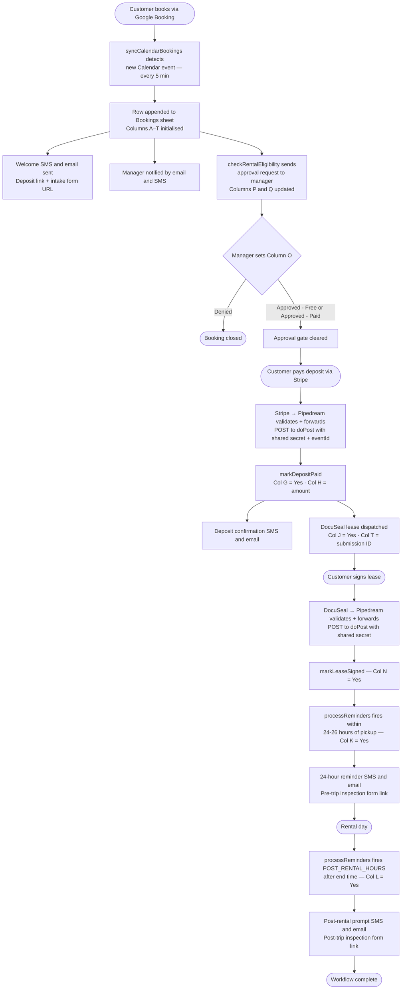
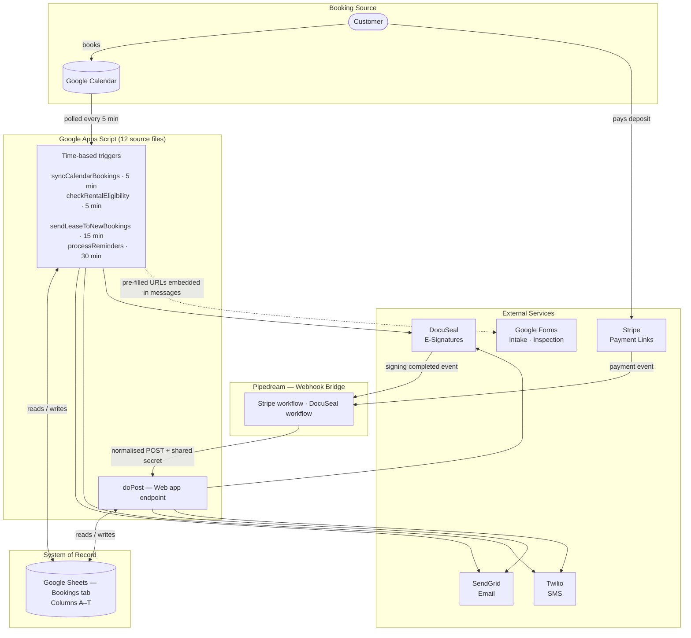

# Reliable Storage — Truck Rental Automation

> **Production system.** Automates the complete truck rental workflow for Reliable Storage across
> four locations and two vehicle types — from calendar booking through post-rental inspection
> follow-up — with no manual staff intervention required for the routine lifecycle.

---

## Table of Contents

1. [Project Overview](#1-project-overview)
2. [Rental Workflow](#2-rental-workflow)
3. [System Architecture](#3-system-architecture)
4. [Repository Structure](#4-repository-structure)
5. [Source File Reference](#5-source-file-reference)
6. [Bookings Sheet](#6-bookings-sheet)
7. [Google Forms](#7-google-forms)
8. [Script Properties Reference](#8-script-properties-reference)
9. [DocuSeal Integration](#9-docuseal-integration)
10. [Stripe Integration](#10-stripe-integration)
11. [Notifications](#11-notifications)
12. [Approval State Machine](#12-approval-state-machine)
13. [Webhook Security](#13-webhook-security)
14. [Sandbox Environment](#14-sandbox-environment)
15. [Testing](#15-testing)
16. [Development Workflow](#16-development-workflow)
17. [Deployment](#17-deployment)
18. [Adding a New Location](#18-adding-a-new-location)
19. [Adding a New Vehicle Type](#19-adding-a-new-vehicle-type)
20. [Troubleshooting](#20-troubleshooting)
21. [Known Limitations and Future Work](#21-known-limitations-and-future-work)
22. [Code Style](#22-code-style)

---

## 1. Project Overview

Reliable Storage is a Pacific Northwest storage and moving truck rental company with locations
across the Kitsap Peninsula. This repository contains the Google Apps Script automation that
handles every step of the truck rental process from the moment a customer books through the
post-rental inspection follow-up.

### Active sites

| Location | Vehicle | Calendar Script Property |
|---|---|---|
| Bainbridge | Cargo Van | `CALENDAR_ID_BAINBRIDGE_CARGO_VAN` |
| Poulsbo | Moving Truck | `CALENDAR_ID_POULSBO_MOVING_TRUCK` |
| Port Orchard | Moving Truck | `CALENDAR_ID_PORT_ORCHARD_MOVING_TRUCK` |
| Fairgrounds | Moving Truck | `CALENDAR_ID_FAIRGROUNDS_MOVING_TRUCK` |

### What the system does automatically

- Detects new Google Calendar bookings every 5 minutes and sends the customer a welcome message
  with their deposit payment link and pre-filled rental intake form URL
- Notifies the site manager of every new booking and initiates the manager approval loop
- Sends a DocuSeal e-signature lease to the customer (and second driver, if any) after the deposit
  clears; writes the DocuSeal submission ID to the sheet
- Monitors for manager approval and sends escalating reminders until the manager responds or the
  escalation cap is reached
- Sends a 24-hour pickup reminder with a pre-filled pre-trip inspection form link; includes a
  deposit urgency notice if payment has not yet cleared
- Sends a post-rental inspection prompt after the rental ends
- Routes all Stripe deposit and DocuSeal signing events through Pipedream into the Apps Script
  web app endpoint with shared-secret authentication

### Tech stack

| Layer | Technology |
|---|---|
| Automation runtime | Google Apps Script (V8) |
| Booking source | Google Calendar (Appointment Schedules) |
| System of record | Google Sheets (Bookings tab, columns A–T) |
| E-mail | SendGrid REST API |
| SMS | Twilio REST API |
| E-signature | DocuSeal REST API |
| Payments | Stripe Payment Links |
| Webhook bridge | Pipedream |
| Forms | Google Forms (pre-filled URLs) |

### Core design principle

**The sheet is the only state.** The script holds no state between runs. Every execution reads the
current sheet data, decides what actions are needed based on flag columns, takes those actions,
and writes updated flags. Two executions on the same row always converge on the same outcome
because flag checks are idempotent.

---

## 2. Rental Workflow

### Linear flow

```
Customer books vehicle via Google Booking
            │
            ▼
  Google Calendar event created
            │
            ▼
  syncCalendarBookings detects event (every 5 min)
            │
            ▼
  Row appended to Bookings sheet (columns A–T initialized)
            │
            ├──▶  Welcome SMS + email sent to customer
            │       • Deposit payment link (Stripe, per vehicle type)
            │       • Pre-filled intake form URL
            │
            ├──▶  Manager notified (email + SMS)
            │
            └──▶  Intake Sent flag → Col I = Yes
                        │
                        ▼
            checkRentalEligibility begins approval loop
                        │
                  ┌─────┴───────────────────────────────────┐
                  │ Manager reviews and sets Col O to one of │
                  │  • Approved - Free                       │
                  │  • Approved - Paid                       │
                  │  • Denied                                │
                  └─────┬───────────────────────────────────┘
                        │
            ┌───────────┴───────────┐
            │                       │
            ▼                       ▼
         Denied                  Approved
         (done)                     │
                                    ▼
                  Customer completes Intake Form
                    • Name, email, phone, date
                    • Driver's license photo
                    • Insurance document
                         │
                         ▼
                  Customer pays deposit via Stripe Payment Link
                         │
                         ▼
                  Stripe → Pipedream → doPost (markDepositPaid)
                    • Col G (Deposit Paid) = Yes
                    • Col H (Stripe Amount) = amount
                    • Deposit confirmation SMS + email sent
                         │
                         ▼
                  DocuSeal lease dispatched
                    • Customer (+ second driver if present) receives signing request
                    • Manager receives co-signer request
                    • Col J (Lease Sent) = Yes
                    • Col T (DocuSeal Submission ID) = submission ID
                         │
                         ▼
                  Customer (and second driver) signs lease
                         │
                         ▼
                  DocuSeal → Pipedream → doPost (markLeaseSigned)
                    • Col N (Lease Signed) = Yes
                         │
                         ▼
                  processReminders — 24-hour window before pickup
                    • Col K (24hr Sent) = Yes (written BEFORE sending)
                    • 24-hr reminder SMS + email to customer
                    • Pre-filled pre-trip inspection form link
                    • Manager notified with deposit/lease status summary
                         │
                         ▼
                  Rental day
                         │
                         ▼
                  processReminders — POST_RENTAL_HOURS after end time
                    • Col L (Post-Rental Sent) = Yes (written BEFORE sending)
                    • Post-rental SMS + email to customer
                    • Pre-filled post-trip inspection form link
                    • Manager notified
                         │
                         ▼
                  Customer completes Vehicle Inspection Form
                    • Pre-filled with name, email, date, inspection type
                    • Photo uploads
                         │
                         ▼
                  Workflow complete
```

### Implementation notes

- `syncCalendarBookings` extracts customer name, email, phone, and second driver email from the
  structured HTML in the Calendar event description — not from the event title. The event title
  typically contains only vehicle/location info.

- Deposit and approval can arrive in either order. `markDepositPaid` sends the lease immediately
  on payment (regardless of approval status). `sendLeaseToNewBookings` is a catch-up engine that
  runs every 15 minutes and sends the lease to any row where the deposit is paid and the lease
  has not yet been sent — covering the case where payment cleared before the lease was dispatched
  (e.g., approval came in after deposit, or a transient DocuSeal error on first attempt).

- Column O (`Rental Approved`) is enforced by a data-validation dropdown. The script never writes
  to this column under any circumstance. Only the site manager sets it.

- Stripe embeds the Google Calendar event ID (base64 URL-safe encoded) as the
  `client_reference_id` on each payment link. When a deposit clears, Pipedream passes this
  encoded ID to `doPost` as `eventId`. `markDepositPaid` decodes it and matches the payment to
  the correct booking row by event ID first, falling back to email matching for older rows.

- The 24-hour reminder fires when `hoursUntilStart` is between 0 and 26, covering the full
  30-minute trigger interval without gaps. It only fires for approved bookings.

- If the deposit has not cleared when the 24-hour reminder fires, the reminder becomes an urgency
  notice with the Stripe payment link instead of the inspection form link.

- The post-rental prompt fires `POST_RENTAL_HOURS` after the event end time. If the Calendar
  event has no end time, the script defaults to start time + 4 hours.

- The manager is automatically BCC'd on every customer-facing email. Emails already addressed to
  the manager or admin are excluded from the BCC to avoid duplicate copies.

### Full workflow diagram



---

## 3. System Architecture

### Two execution paths

The system has two independent execution paths that converge on Google Sheets as the shared
system of record.

```
┌─────────────────────────────────────────────────────┐
│                  TRIGGER PATH                        │
│  (time-based, runs continuously)                     │
│                                                      │
│  Google Calendar                                     │
│       │ polled every 5 min                          │
│       ▼                                             │
│  Apps Script Triggers                                │
│  ├─ syncCalendarBookings    (5 min)                 │
│  ├─ checkRentalEligibility  (5 min)                 │
│  ├─ sendLeaseToNewBookings  (15 min)                │
│  └─ processReminders        (30 min)                │
│       │                                             │
│       ▼                                             │
│  Google Sheets ◄──────────────── reads / writes     │
│       │                                             │
│       ├──▶ SendGrid  (emails)                       │
│       ├──▶ Twilio    (SMS)                          │
│       ├──▶ DocuSeal  (lease submissions)            │
│       └──▶ Google Forms (pre-filled URLs in msgs)   │
└─────────────────────────────────────────────────────┘

┌─────────────────────────────────────────────────────┐
│                  WEBHOOK PATH                        │
│  (event-driven, fires on payment / signing)          │
│                                                      │
│  Stripe ──────┐                                     │
│               │ webhook events                      │
│  DocuSeal ────┤                                     │
│               ▼                                     │
│  Pipedream (validates signatures,                    │
│             normalises payloads,                     │
│             injects shared secret + eventId)         │
│               │                                     │
│               ▼                                     │
│  Apps Script Web App (doPost)                        │
│               │                                     │
│               ▼                                     │
│  Google Sheets ◄──────────────── reads / writes     │
│               │                                     │
│               ├──▶ SendGrid  (confirmation emails)  │
│               ├──▶ Twilio    (confirmation SMS)     │
│               └──▶ DocuSeal  (lease submissions)    │
└─────────────────────────────────────────────────────┘
```

### Detailed architecture diagram



### Multi-site design

Multiple locations and vehicle types are driven entirely by `CALENDAR_CONFIGS` in `Config.js` —
the single source of truth for which calendars to poll, which location they belong to, and which
vehicle type they serve:

```javascript
const CALENDAR_CONFIGS = [
  { propKey: 'CALENDAR_ID_BAINBRIDGE_CARGO_VAN',      calendarId: PROPS.CALENDAR_ID_BAINBRIDGE_CARGO_VAN,      location: 'Bainbridge',   vehicleType: 'Cargo Van' },
  { propKey: 'CALENDAR_ID_POULSBO_MOVING_TRUCK',      calendarId: PROPS.CALENDAR_ID_POULSBO_MOVING_TRUCK,      location: 'Poulsbo',      vehicleType: 'Moving Truck' },
  { propKey: 'CALENDAR_ID_PORT_ORCHARD_MOVING_TRUCK', calendarId: PROPS.CALENDAR_ID_PORT_ORCHARD_MOVING_TRUCK, location: 'Port Orchard', vehicleType: 'Moving Truck' },
  { propKey: 'CALENDAR_ID_FAIRGROUNDS_MOVING_TRUCK',  calendarId: PROPS.CALENDAR_ID_FAIRGROUNDS_MOVING_TRUCK,  location: 'Fairgrounds',  vehicleType: 'Moving Truck' },
];
```

`syncCalendarBookings` iterates every entry in one pass. Entries whose Script Property is not set
(`calendarId` is `undefined`) are silently skipped with a log entry. Each booking row records its
location and vehicle type in columns R and S, which drive per-vehicle deposit amounts and Stripe
payment URLs in all downstream messages.

`setupSheetSchema()` derives the column R and S dropdown validation lists directly from
`CALENDAR_CONFIGS`, so adding a new entry automatically extends both dropdowns on the next
`setupSheetSchema()` run.

**Vehicle-type resolution:** deposit amounts and Stripe URLs are looked up by vehicle type string
in `getDepositAmount()` and `getStripePaymentUrl()` in `Helpers.js`. These functions contain
explicit object-map lookup tables. An unknown vehicle type falls back to the generic
`DEPOSIT_AMOUNT` and `STRIPE_PAYMENT_URL` Script Properties with a warning log entry. Adding a
new vehicle type requires updating both lookup tables. See
[Adding a New Vehicle Type](#19-adding-a-new-vehicle-type).

---

## 4. Repository Structure

```
src/                          ← working copy — paste each file into Apps Script
  Config.js                   ← PROPS, CONFIG, CALENDAR_CONFIGS
  CalendarSync.js             ← syncCalendarBookings() — Engine 1
  Leases.js                   ← sendLeaseToNewBookings() — Engine 2 (catch-up)
  Approval.js                 ← checkRentalEligibility() — Engine 2b
  Reminders.js                ← processReminders() — Engine 3
  Notifications.js            ← sendSms(), sendEmailHtml(), alertAdmin()
  DocuSeal.js                 ← sendLeaseViaDocuSeal(), extractDocuSealSubmissionId()
  Webhooks.js                 ← doPost(), doGet(), markDepositPaid(), markLeaseSigned()
  Forms.js                    ← buildIntakeUrl(), buildInspectUrl()
  Helpers.js                  ← getSheet(), extraction helpers, formatters,
                                 getDepositAmount(), getStripePaymentUrl()
  Setup.js                    ← setupTriggers(), setupSheetSchema()
  SandboxTests.js             ← manual test functions — never wire to triggers

archive/
  v7-original.js              ← unmodified v7 source — never edit

docs/
  setup-notes.md              ← Script Properties reference, sheet schema,
                                 trigger setup, Pipedream workflow config
  testing-plan.md             ← step-by-step end-to-end flow test checklist
  sandbox-plan.md             ← sandbox environment setup notes
  architecture-proposal.md    ← historical design notes from the multi-site migration
  production-diff-summary.md  ← v7 → v8 change analysis

CLAUDE.md                     ← context for AI-assisted development
README.md                     ← this file
```

**All 12 `src/*.js` files share one global scope** when deployed to Google Apps Script. There is
no module system, no `import`, no `export`. Functions in one file call functions in another
freely. Load order between files is irrelevant — no file has top-level code that depends on
another file's declarations at parse time. `PROPS`, `CONFIG`, and `CALENDAR_CONFIGS` are declared
in `Config.js` and referenced inside function bodies in every other file.

---

## 5. Source File Reference

### Config.js

Owns all configuration. Runs at module-parse time (top-level code).

```javascript
const PROPS = PropertiesService.getScriptProperties().getProperties();
```

`PROPS` is a flat object of all Script Properties, loaded once per execution. Undefined properties
return `undefined` (not `null`) in Google Apps Script.

`CONFIG` is a plain object that maps internal key names to Script Property values. Numeric
properties are wrapped in `Number()` at this point so all downstream code receives the correct
type. `CALENDAR_CONFIGS` is an array of location/vehicle/calendar entries built from `PROPS`.

> **Important:** The internal CONFIG key names for DocuSeal differ from the Script Property
> names. `CONFIG.DOCUSEAL_KEY` reads from Script Property `DOCUSEAL_API_KEY`.
> `CONFIG.DOCUSEAL_TEMPLATE_SINGLE` reads from Script Property `DOCUSEAL_TEMPLATE_ONE_DRIVER`.
> This mapping is intentional — internal keys are stable; Script Property names match the
> external service's terminology.

---

### CalendarSync.js — Engine 1

**Function:** `syncCalendarBookings()`
**Trigger:** Every 5 minutes

Polls every calendar in `CALENDAR_CONFIGS`. For each event whose ID is not already in the sheet:
extracts customer data from the event description HTML, appends a 19-column row (A–S; column T is
left blank), sends the welcome SMS and email, notifies the manager, and marks column I
(Intake Sent) = `Yes`.

The Stripe payment link embedded in the welcome message appends the Google Calendar event ID
(base64 URL-safe encoded via `Utilities.base64EncodeWebSafe`) as `?client_reference_id=...`.
Stripe includes this value in its webhook events, which Pipedream passes to `doPost` as `eventId`.
This allows `markDepositPaid` to match payments to rows by event ID rather than by email alone.

**Deduplication:** Uses event IDs, not the Intake Sent flag. `getExistingEventIds()` loads all
event IDs from column A before the loop. An event already in the sheet is skipped before any
message is sent.

---

### Leases.js — Engine 2 (catch-up)

**Function:** `sendLeaseToNewBookings()`
**Trigger:** Every 15 minutes

Scans all rows for bookings where the deposit is paid (G = Yes) but the lease has not been sent
(J ≠ Yes) and the booking is approved. Sends the DocuSeal lease and writes J = Yes and T =
submission ID. This is the catch-up path for cases where `markDepositPaid` could not send the
lease (e.g., DocuSeal was temporarily unreachable, or approval arrived after the deposit was paid).

---

### Approval.js — Engine 2b

**Function:** `checkRentalEligibility()`
**Trigger:** Every 5 minutes

Drives the manager approval state machine using columns P and Q. Only processes rows where column
I (Intake Sent) = `Yes`. Skips rows where column O (Rental Approved) has any decision value.
Never writes to column O. See [Approval State Machine](#12-approval-state-machine).

---

### Reminders.js — Engine 3

**Function:** `processReminders()`
**Trigger:** Every 30 minutes

Acquires a `LockService.getScriptLock()` with a 10-second timeout to prevent overlapping
executions. Scans all rows and sends two types of messages:

- **24-hour reminder** — when `hoursUntilStart` is between 0 and 26 and column K is blank and
  the booking is approved. **Writes column K = Yes and flushes before sending** — the
  flag-before-send pattern prevents duplicate reminders if the trigger fires again mid-send.

- **Post-rental prompt** — when hours since end time ≥ `POST_RENTAL_HOURS` and column L is blank.
  **Writes column L = Yes and flushes before sending** — same pattern.

Rows older than 48 hours past end time with both K and L set are skipped to limit the scan
window.

---

### Notifications.js

**Functions:** `sendSms(toPhone, message)`, `sendEmailHtml(toEmail, subject, htmlBody)`,
`alertAdmin(subject, body)`

`sendEmailHtml` builds a SendGrid v3 `/mail/send` payload. It automatically BCC's
`CONFIG.MANAGER_EMAIL` on every customer-facing email, but suppresses the BCC when `toEmail` is
the manager or admin (to avoid duplicate copies on emails already addressed to them).

`sendSms` posts to the Twilio Messages REST API using Basic Auth with TWILIO_SID:TWILIO_TOKEN.

`alertAdmin` logs the message at `[ALERT]` level and emails `CONFIG.ADMIN_EMAIL` via
`sendEmailHtml`. If `sendEmailHtml` itself fails, the failure is logged but not re-thrown (alerts
must not cause further exceptions).

---

### DocuSeal.js

**Functions:** `sendLeaseViaDocuSeal(name, email, secondEmail, startTime, endTime, vehicleType, location)`,
`extractDocuSealSubmissionId(response)`

`sendLeaseViaDocuSeal` selects the correct template based on whether a second driver email is
present, builds the submitters array with exact role names (`Driver #1` for both single- and
two-driver templates), and POSTs to `https://api.docuseal.com/submissions` using
`CONFIG.DOCUSEAL_KEY` as the `X-Auth-Token` header. The `startTime` and `endTime` Date objects
are used to prefill `pickup_datetime`, `return_datetime`, and `reservation_date` fields on the
lease document. Returns the parsed JSON response. Throws on HTTP 4xx/5xx.

`extractDocuSealSubmissionId` takes the parsed response and returns the shared submission ID.
The DocuSeal API returns an array of submitter objects. This function collects `submission_id`
(or `submission.id`) from each array element — these are the shared identifier common to all
signers. It returns null with a warning log if no ID is found or if IDs conflict across elements.
The response structure is logged on every call (keys and ID fields, not values).

---

### Webhooks.js

**Functions:** `doPost(e)`, `doGet()`, `markDepositPaid(customerEmail, amountPaid, eventId)`,
`markLeaseSigned(submissionId, signerEmail)`

`doPost` is the Apps Script web app entry point. It validates the shared secret, then routes to
either `markLeaseSigned` (for `type === 'lease_signed'`) or `markDepositPaid` (for Stripe
payment events). Always returns HTTP 200 with `{ received: true }` — non-200 would trigger
Pipedream retry loops. Secret validation failures return `{ received: false }`.

`doGet` returns `{COMPANY_NAME} webhook endpoint is live.` as plain text (where `{COMPANY_NAME}`
is the value of the `COMPANY_NAME` Script Property). Used to verify the deployment URL is
reachable.

`markDepositPaid` matches the incoming payment to a booking row using two strategies in order:

1. **Primary — event ID match:** Stripe passes the Google Calendar event ID (base64 URL-safe
   encoded) as `client_reference_id`. `doPost` decodes it and passes it as `eventId`.
   `markDepositPaid` searches column A for a row with a matching event ID and an unpaid deposit.

2. **Fallback — email match:** If no event ID is present (or no match found), searches column C
   for a case-insensitive email match with an unpaid deposit. This covers rows created before
   the `client_reference_id` feature was added.

After matching, it writes G = Yes and H = amount, sends confirmation SMS (in an isolated
try/catch so SMS failure cannot block email or DocuSeal) and email, then calls
`sendLeaseViaDocuSeal`. **The lease send is inside a try/catch** — if DocuSeal fails, J and T
are not written (the catch-up engine handles it). Writes J = Yes and T = submission ID after a
successful DocuSeal call.

`markLeaseSigned(submissionId, signerEmail)` uses the same two-strategy lookup:

1. **Primary — submission ID match:** Searches column T for a matching DocuSeal submission ID
   (normalized to string).

2. **Fallback — email match:** If no submission ID is provided or found, searches column C.

> **Note:** `WEBHOOK_SHARED_SECRET` is read directly from `PROPS` in `doPost`, not from
> `CONFIG`. This is intentional — the shared secret is needed before `CONFIG` is guaranteed to be
> fully valid, and it bypasses the CONFIG layer to avoid any potential misconfiguration masking
> the secret check.

---

### Forms.js

**Functions:** `buildIntakeUrl(name, email, phone, rentalDate)`,
`buildInspectUrl(name, email, rentalDate, type)`

Builds pre-filled Google Forms URLs by appending query parameters with entry IDs from Script
Properties. The intake form uses `yyyy-MM-dd` date format. The inspection form uses
`MMMM d, yyyy` (human-readable) — Google Forms date fields accept different formats depending on
the field type; these values match the configured field types.

---

### Helpers.js

**Functions:** `getSheet()`, `getExistingEventIds(sheet)`, `extractBookedByName(text)`,
`extractPrimaryEmail(text)`, `extractSecondDriverEmail(text)`, `extractPhone(text)`, `toDate()`,
`formatDate()`, `formatDateForForm()`, `formatDateTime()`, `getDepositAmount(vehicleType)`,
`getStripePaymentUrl(vehicleType)`

`getSheet()` reads `SHEET_ID` directly via
`PropertiesService.getScriptProperties().getProperty('SHEET_ID')` — it does NOT go through the
`PROPS`/`CONFIG` pattern. This is because `getSheet()` may be called during Setup before `CONFIG`
is fully validated.

The extraction functions parse structured HTML in Google Calendar event descriptions:

- `extractBookedByName` — matches `<b>Booked by</b>` followed by the name on the next line
- `extractPrimaryEmail` — finds the first bare email address not preceded by a "second" label
- `extractSecondDriverEmail` — finds the email after a `<b>Second Driver…</b>` label
- `extractPhone` — normalises any US phone format to `+1XXXXXXXXXX`

`getDepositAmount` and `getStripePaymentUrl` use explicit object-map lookup tables keyed on the
vehicle type string. Unknown vehicle types fall back to the generic Script Properties with a
warning log.

---

### Setup.js

**Functions:** `setupTriggers()`, `setupSheetSchema()`

`setupTriggers()` deletes all existing project triggers and creates the four production triggers.
Then calls `setupSheetSchema()`. **Run this once manually** after initial deployment or whenever
trigger configuration changes.

`setupSheetSchema()` writes `Vehicle Type` to the R1 cell (if blank) and applies dropdown
validation to column R from the unique vehicle types in `CALENDAR_CONFIGS`. Same for `Location`
in column S. Safe to re-run — it only writes headers if the cell is currently blank, and always
re-applies validation. **Does not touch any other column headers** — columns A–Q and T must be
set up manually.

---

### SandboxTests.js

Contains all manual test, validation, and diagnostic functions. Run from the Apps Script editor
toolbar. Never wire any of these to triggers. See [Testing](#15-testing) for the complete
function reference.

---

## 6. Bookings Sheet

The sheet must have a tab named `Bookings` (exact, case-sensitive). Row 1 is headers. Data starts
at row 2.

### Column reference

| Col | Header | Written by | Notes |
|---|---|---|---|
| A | Event ID | `syncCalendarBookings` | Google Calendar event ID; used for deduplication and payment matching |
| B | Customer Name | `syncCalendarBookings` | Extracted from event description HTML |
| C | Email | `syncCalendarBookings` | Primary customer email; `No Email` if absent |
| D | Phone | `syncCalendarBookings` | E.164 format with leading `'` to prevent spreadsheet reformatting; `No Phone` if absent |
| E | Start Time | `syncCalendarBookings` | Google Calendar event start time as a Date object |
| F | End Time | `syncCalendarBookings` | Calendar event end time; defaults to start + 4 hours in processReminders if blank |
| G | Deposit Paid | `markDepositPaid` (webhook) | Set to `Yes` when Stripe payment confirmed |
| H | Stripe Amount | `markDepositPaid` (webhook) | Dollar amount received; informational only |
| I | Intake Sent | `syncCalendarBookings` | Set to `Yes` after welcome message sent; gates the approval loop |
| J | Lease Sent | `markDepositPaid`, `sendLeaseToNewBookings` | Set to `Yes` after DocuSeal submission succeeds |
| K | 24hr Sent | `processReminders` | Set to `Yes` **before** the reminder is sent (flag-before-send) |
| L | Post-Rental Sent | `processReminders` | Set to `Yes` **before** the post-rental message is sent |
| M | Second Driver Email | `syncCalendarBookings` | Second driver's email if provided; `No Second Email` if absent |
| N | Lease Signed | `markLeaseSigned` (webhook) | Set to `Yes` when DocuSeal signing event received |
| O | Rental Approved | **Manager only** | **Script never writes this column.** Dropdown: `Approved - Free`, `Approved - Paid`, `Denied` |
| P | Approval Notified At | `checkRentalEligibility` | Timestamp of last approval notification sent to manager |
| Q | Approval Reminder Count | `checkRentalEligibility` | Number of notifications sent; > `MAX_APPROVAL_REMINDERS` = permanently silenced |
| R | Vehicle Type | `syncCalendarBookings` | From `CALENDAR_CONFIGS[n].vehicleType`; drives deposit and Stripe URL lookup |
| S | Location | `syncCalendarBookings` | From `CALENDAR_CONFIGS[n].location`; informational |
| T | DocuSeal Submission ID | `markDepositPaid`, `sendLeaseToNewBookings` | Submission ID returned by DocuSeal API; written only if `extractDocuSealSubmissionId` returns a non-null value |

### Flag semantics

- **Column O** is the only column that gates downstream behaviour. The approval loop in
  `checkRentalEligibility` checks for specific string values (`Approved - Free`,
  `Approved - Paid`, `Denied`). Any other value (including blank) leaves the row in the pending
  state.

- **Columns G, I, J, K, L, N** are all binary flags — the script only checks whether the value
  is exactly `Yes`. Any other value (including blank) is treated as "not done."

- **Column Q** is numeric. The script reads it with `Number(data[i][16]) || 0`, so a blank or
  non-numeric value is treated as 0 (no notifications sent).

### Data validation

Column O must have a data-validation dropdown restricted to exactly these three values:
```
Approved - Free
Approved - Paid
Denied
```

Columns R and S have dropdown validation applied automatically by `setupSheetSchema()`. The
values are derived from `CALENDAR_CONFIGS`, so they stay in sync automatically.

Column T has no validation; it holds a numeric submission ID written by the script.

### Column T — DocuSeal Submission ID

Column T was added after the initial deployment. It is not initialised to empty string in the
`appendRow` call in `syncCalendarBookings` (which writes 19 values, A–S). New rows leave T blank
until a lease is successfully sent. Existing rows from before T was added will also have a blank T
unless a lease is resent.

### Location tabs and QUERY formulas

The Bookings sheet may have additional per-location tabs that use `QUERY` formulas to filter the
main Bookings tab by the Location column (S). These tabs are a Google Sheets feature maintained
separately from the script — the script reads and writes only the main Bookings tab. Adding a new
location does not automatically create a filtered tab; that must be done manually.

---

## 7. Google Forms

Two Google Forms support the rental workflow. The script generates pre-filled URLs for both forms;
it does not read form responses or manage form structure.

### Rental Intake Form

**Purpose:** Collects customer information and required documents before the rental date.

**When sent:** Included in the welcome SMS and email at the time of booking (`syncCalendarBookings`).

**Pre-filled fields (from Script Properties):**

| Field | Entry ID Property | Value |
|---|---|---|
| Customer name | `INTAKE_ENTRY_NAME` | From calendar event description |
| Customer email | `INTAKE_ENTRY_EMAIL` | From calendar event description |
| Customer phone | `INTAKE_ENTRY_PHONE` | From calendar event description |
| Rental date | `INTAKE_ENTRY_DATE` | Start time in `yyyy-MM-dd` format |

**Typical intake form fields** (configured in Google Forms, not the script):
- Customer name, email, phone (pre-filled)
- Rental date (pre-filled)
- Driver's license photo upload
- Insurance document upload
- Additional driver information if applicable

Google Forms file upload responses are saved to a Google Drive folder configured in the form's
settings. The script does not interact with this folder.

**Config keys:** `INTAKE_FORM_BASE`, `INTAKE_ENTRY_NAME`, `INTAKE_ENTRY_EMAIL`,
`INTAKE_ENTRY_PHONE`, `INTAKE_ENTRY_DATE`

---

### Vehicle Inspection Form

**Purpose:** Documents vehicle condition with timestamped photos before and after every rental.

**When sent:**
- Pre-trip link in the 24-hour reminder email/SMS (`processReminders`)
- Post-trip link in the post-rental email/SMS (`processReminders`)

**Pre-filled fields (from Script Properties):**

| Field | Entry ID Property | Value |
|---|---|---|
| Customer name | `INSPECT_ENTRY_NAME` | From sheet column B |
| Customer email | `INSPECT_ENTRY_EMAIL` | From sheet column C |
| Rental date | `INSPECT_ENTRY_DATE` | Start time in `MMMM d, yyyy` format |
| Inspection type | `INSPECT_ENTRY_TYPE` | `INSPECT_VAL_PRE` or `INSPECT_VAL_POST` |

The inspection type dropdown in the form uses exact option text values stored in `INSPECT_VAL_PRE`
and `INSPECT_VAL_POST` Script Properties. These must exactly match the option text in the Google
Form's dropdown field.

**Config keys:** `INSPECT_FORM_BASE`, `INSPECT_ENTRY_NAME`, `INSPECT_ENTRY_EMAIL`,
`INSPECT_ENTRY_DATE`, `INSPECT_ENTRY_TYPE`, `INSPECT_VAL_PRE`, `INSPECT_VAL_POST`

---

## 8. Script Properties Reference

All 43 Script Properties must be set in **Apps Script → Project Settings → Script Properties**.
No value ever belongs in source code.

### Identity and routing

| Property | Description | Example | Secret | Required | Used in |
|---|---|---|---|---|---|
| `SHEET_ID` | Google Spreadsheet ID (from sheet URL) | `1BxiM...` | No | Yes | `Helpers.js` |
| `SHEET_NAME` | Bookings tab name | `Bookings` | No | Yes | `Config.js` |
| `COMPANY_NAME` | Business name used in customer-facing emails, SMS, and the webhook liveness response | `Reliable Storage` | No | Yes | `Config.js` |
| `ADMIN_EMAIL` | Escalation address for unanswered approvals and script errors | `admin@example.com` | No | Yes | `Config.js` |
| `MANAGER_EMAIL` | Site manager — BCC'd on all customer emails, receives booking/approval notices | `manager@example.com` | No | Yes | `Config.js` |
| `MANAGER_PHONE` | Site manager phone in E.164 format | `+12065551234` | No | No | `Config.js` |
| `FROM_NAME` | Display name for outbound emails | `Reliable Storage` | No | Yes | `Config.js` |

> **`SHEET_ID` note:** Unlike all other properties, `SHEET_ID` is read directly via
> `getProperty('SHEET_ID')` inside `Helpers.js`, not through the `PROPS`/`CONFIG` pattern. This
> is the one property that bypasses `Config.js`.

> **`COMPANY_NAME` note:** Used in `doGet()` for the liveness response, in DocuSeal email
> subjects and bodies, and in customer-facing SMS. If unset, these messages will include the
> string `undefined`.

### Google Calendar

One property per active calendar. Calendars whose property is not set are silently skipped.

| Property | Location | Vehicle |
|---|---|---|
| `CALENDAR_ID_BAINBRIDGE_CARGO_VAN` | Bainbridge | Cargo Van |
| `CALENDAR_ID_POULSBO_MOVING_TRUCK` | Poulsbo | Moving Truck |
| `CALENDAR_ID_PORT_ORCHARD_MOVING_TRUCK` | Port Orchard | Moving Truck |
| `CALENDAR_ID_FAIRGROUNDS_MOVING_TRUCK` | Fairgrounds | Moving Truck |

The Calendar ID is the full `*@group.calendar.google.com` address found in Google Calendar →
Settings → Integrate calendar → Calendar ID. The Apps Script service account must be shared on
each calendar with at least read access.

### Stripe

| Property | Description | Example | Secret | Required |
|---|---|---|---|---|
| `STRIPE_PAYMENT_URL_CARGO_VAN` | Public Stripe payment link for cargo van deposit | `https://buy.stripe.com/...` | No | Yes (for Cargo Van) |
| `STRIPE_PAYMENT_URL_MOVING_TRUCK` | Public Stripe payment link for moving truck deposit | `https://buy.stripe.com/...` | No | Yes (for Moving Truck) |
| `STRIPE_PAYMENT_URL` | Fallback payment link for rows with blank Vehicle Type column | `https://buy.stripe.com/...` | No | Recommended |

The payment links embedded in welcome messages automatically include
`?client_reference_id=<base64-encoded-event-id>`. This allows `markDepositPaid` to identify
which booking row a payment belongs to by event ID rather than email alone.

### Deposit amounts

| Property | Description | Example | Secret | Required |
|---|---|---|---|---|
| `DEPOSIT_AMOUNT_CARGO_VAN` | Dollar amount shown in customer messages | `50` | No | Yes (for Cargo Van) |
| `DEPOSIT_AMOUNT_MOVING_TRUCK` | Dollar amount shown in customer messages | `100` | No | Yes (for Moving Truck) |
| `DEPOSIT_AMOUNT` | Fallback for rows with blank Vehicle Type column | `50` | No | Recommended |

These are strings used directly in message text (e.g., "pay your $50 deposit"). They are not used
for any financial calculation.

### Twilio (SMS)

| Property | Description | Secret | Required |
|---|---|---|---|
| `TWILIO_SID` | Twilio Account SID — begins with `AC`, followed by 32 alphanumeric characters (34 chars total) | **Yes** | Yes |
| `TWILIO_TOKEN` | Twilio Auth Token — used for Basic Auth alongside the SID | **Yes** | Yes |
| `TWILIO_NUM` | Sending number in E.164 format — must be SMS-capable | No | Yes |

All outbound SMS messages send from `TWILIO_NUM`. The site manager can see every customer
conversation in the Twilio App under that number's thread without needing a separate copy
(Twilio also rejects `To == From`).

Both `TWILIO_NUM` and `MANAGER_PHONE` must be in E.164 format: `+` followed by 7–15 digits
(e.g., `+12065551234`). A missing country code produces Twilio "Invalid To Phone Number" errors.

On a Twilio trial account, all outbound SMS are prefixed with "Sent from your Twilio trial
account — " and can only be delivered to individually verified phone numbers.

### SendGrid (email)

| Property | Description | Secret | Required |
|---|---|---|---|
| `SENDGRID_KEY` | SendGrid API key (`SG....`) — must have the **Mail Send** permission scope | **Yes** | Yes |
| `FROM_EMAIL` | Sender address — must be a verified sender in SendGrid | No | Yes |
| `REPLY_TO_EMAIL` | Reply-to address (typically the site manager) | No | Yes |

`FROM_EMAIL` must be either a verified single sender or belong to an authenticated domain in your
SendGrid account. An unverified sender produces HTTP 403 errors logged as admin alerts.

### DocuSeal (e-signature)

| Property | Description | Example | Secret | Required |
|---|---|---|---|---|
| `DOCUSEAL_API_KEY` | DocuSeal API key (sent as `X-Auth-Token` header) | `abc123...` | **Yes** | Yes |
| `DOCUSEAL_TEMPLATE_ONE_DRIVER` | Template ID for single-driver lease | `1234567` | No | Yes |
| `DOCUSEAL_TEMPLATE_TWO_DRIVERS` | Template ID for two-driver lease | `7654321` | No | Yes |

> **CONFIG key mapping:** The internal code uses `CONFIG.DOCUSEAL_KEY` and
> `CONFIG.DOCUSEAL_TEMPLATE_SINGLE` — these names appear throughout the source. They map from the
> Script Properties `DOCUSEAL_API_KEY` and `DOCUSEAL_TEMPLATE_ONE_DRIVER` respectively. The
> mapping is in `Config.js` lines 87–89. Do not rename the internal CONFIG keys; only the Script
> Property names matter for the Apps Script console.

### Intake Form (Form 1)

| Property | Description |
|---|---|
| `INTAKE_FORM_BASE` | Google Form base URL |
| `INTAKE_ENTRY_NAME` | Form entry ID for name field |
| `INTAKE_ENTRY_EMAIL` | Form entry ID for email field |
| `INTAKE_ENTRY_PHONE` | Form entry ID for phone field |
| `INTAKE_ENTRY_DATE` | Form entry ID for date field |

Entry IDs are numeric strings found by inspecting the form's pre-fill URL or via the Google Forms
"Get pre-filled link" tool (the query parameter after `entry.`).

### Inspection Form (Form 2)

| Property | Description |
|---|---|
| `INSPECT_FORM_BASE` | Google Form base URL |
| `INSPECT_ENTRY_NAME` | Form entry ID for name field |
| `INSPECT_ENTRY_EMAIL` | Form entry ID for email field |
| `INSPECT_ENTRY_DATE` | Form entry ID for date field |
| `INSPECT_ENTRY_TYPE` | Form entry ID for inspection type dropdown |
| `INSPECT_VAL_PRE` | Exact text of the pre-trip option |
| `INSPECT_VAL_POST` | Exact text of the post-trip option |

`INSPECT_VAL_PRE` and `INSPECT_VAL_POST` must exactly match the option text in the Google Form
dropdown field — case-sensitive, whitespace-sensitive.

### Operational parameters

These control timing and reminder behaviour. All are parsed as numbers with `Number()`.

| Property | Description | Example | Notes |
|---|---|---|---|
| `DAYS_AHEAD` | How many days ahead to scan each calendar for new bookings | `60` | Lower values reduce API calls; higher values give earlier notice |
| `POST_RENTAL_HOURS` | Hours after rental end time before sending post-rental prompt | `1` | Set to `1` = prompt fires ~1 hour after end |
| `HOURS_BETWEEN_APPROVAL_REMINDERS` | Hours between manager approval reminder emails | `12` | Set to 12 for one reminder per half-day |
| `MAX_APPROVAL_REMINDERS` | Total approval notifications before escalating to admin | `3` | 1 initial + 2 follow-ups + 1 escalation, then permanent silence |

### Webhook authentication

| Property | Description | Secret | Required |
|---|---|---|---|
| `WEBHOOK_SHARED_SECRET` | Shared secret validated in every `doPost` call | **Yes** | Yes |

Generate with: `openssl rand -hex 32`

Set the same value in each Pipedream workflow's POST step as the `secret` field in the JSON body.

---

## 9. DocuSeal Integration

### Templates

DocuSeal templates define the lease document structure and the signing roles. Two templates are
used:

**Single-driver template** (`DOCUSEAL_TEMPLATE_ONE_DRIVER`)

Signing roles (must match exactly in the DocuSeal template):
- `Driver #1` — the primary customer
- `Reliable Storage Manager` — the site manager

**Two-driver template** (`DOCUSEAL_TEMPLATE_TWO_DRIVERS`)

Signing roles:
- `Driver #1` — the primary customer
- `Driver #2` — the second driver
- `Reliable Storage Manager` — the site manager

The role name `Driver #1` is used for the primary customer in **both** templates. The role names
are hardcoded in `DocuSeal.js`. If a template's role names differ, update the strings in
`sendLeaseViaDocuSeal`.

### Pre-filled document fields

The script prefills the following fields on the lease document via the `values` object in the
Driver #1 submitter entry:

| Field name | Value |
|---|---|
| `storage_location` | Location string from column S (e.g., `Bainbridge`) |
| `vehicle_type` | Vehicle type string from column R (e.g., `Cargo Van`) |
| `reservation_date` | Rental date in `MMMM d, yyyy` format |
| `pickup_datetime` | Start time formatted as date + time |
| `return_datetime` | End time formatted as date + time |

Signer names are **not** prefilled — DocuSeal collects these when each party signs.

### Submission flow

1. `markDepositPaid` or `sendLeaseToNewBookings` calls `sendLeaseViaDocuSeal`.
2. `sendLeaseViaDocuSeal` selects the template based on whether a second driver email is present
   and not `No Second Email`.
3. A POST is made to `https://api.docuseal.com/submissions` with the template ID, submitters
   array, prefill values, and an email subject/body.
4. If successful (HTTP < 400), the parsed JSON response is returned.
5. `extractDocuSealSubmissionId` reads the shared submission ID from the response.
6. Column J (Lease Sent) = `Yes` and column T (DocuSeal Submission ID) = the submission ID are
   written to the sheet.
7. If the DocuSeal call fails (throws), neither J nor T is written. The catch-up engine
   (`sendLeaseToNewBookings`) will retry on its next 15-minute run.

### DocuSeal response shape

The `/submissions` endpoint returns an array of submitter objects — one per signer. Each object
has a per-submitter `id` field and a `submission_id` field (or `submission.id`) that is the same
across all signers. `extractDocuSealSubmissionId` collects `submission_id` / `submission.id`
from each element, verifies they all agree, and returns the common value. The per-submitter `id`
is intentionally not used here, as it uniquely identifies a single signer rather than the
submission.

The function logs the response structure on every call:
```
extractDocuSealSubmissionId: isArray=true, length=2
  [0] keys: id, submission_id, role, email, ...
  [0] id=1, submission_id=12345, submitter_id=..., submission.id=(none)
  [1] keys: id, submission_id, role, email, ...
  [1] id=2, submission_id=12345, submitter_id=..., submission.id=(none)
```

After the first real submission, confirm in the Executions log that `submission_id` appears in
each element. If the DocuSeal response shape differs from this, update `extractDocuSealSubmissionId`
in `DocuSeal.js` accordingly.

### Lease email

DocuSeal sends the lease email directly to each signer — it does not go through `sendEmailHtml`.
As a result, the lease email is **not** BCC'd to the manager via the script's BCC logic. The
manager already receives a DocuSeal signing request as a co-signer on every lease.

### Signed event

After all parties sign, DocuSeal sends a webhook event to Pipedream. Pipedream validates the
request, filters to completed signing events, skips the manager signing step (to avoid marking
the lease signed before the customer signs), extracts `signerEmail` and `submissionId`, and POSTs
to `doPost`:

```json
{ "secret": "...", "type": "lease_signed", "submissionId": "...", "signerEmail": "..." }
```

`doPost` routes this to `markLeaseSigned`, which first matches by `submissionId` against column T,
then falls back to email match against column C, and sets column N (Lease Signed) = `Yes`.

### DocuSeal Submission ID (Column T)

The submission ID written to column T is used by `markLeaseSigned` as the primary row-lookup key
when a signing event arrives. This eliminates the ambiguity that would occur if the same email
address appeared in multiple booking rows.

```javascript
const docuSealResp = sendLeaseViaDocuSeal(
  name, email, secondEmail, startTime, endTime, vehicleType, location
);
const submissionId = extractDocuSealSubmissionId(docuSealResp);
sheet.getRange(i + 1, 10).setValue('Yes');       // J: Lease Sent
if (submissionId != null) {
  sheet.getRange(i + 1, 20).setValue(submissionId); // T: DocuSeal Submission ID
}
```

If `extractDocuSealSubmissionId` returns null (missing field or conflicting IDs), a warning is
logged and column T is left blank. Column J is written regardless — the lease was sent even if
the ID could not be captured. In this case `markLeaseSigned` falls back to email matching.

---

## 10. Stripe Integration

### Payment links

Customers pay deposits via public Stripe Payment Links — fixed-price links that Stripe hosts.
No Stripe API key is needed for the customer-facing flow; the links are just URLs. The script
stores one per vehicle type and one fallback:

- `STRIPE_PAYMENT_URL_CARGO_VAN` — sent to all Bainbridge Cargo Van customers
- `STRIPE_PAYMENT_URL_MOVING_TRUCK` — sent to all Moving Truck customers
- `STRIPE_PAYMENT_URL` — fallback for rows where column R is blank (pre-migration rows)

Each link is appended with `?client_reference_id=<encoded-event-id>` where the encoded event ID
is `Utilities.base64EncodeWebSafe(eventId)` with trailing `=` padding stripped. Stripe passes
this value back in its webhook payload, enabling exact row matching on payment.

### Webhook flow

After a customer pays, Stripe sends a webhook event to the Pipedream "Stripe Connection to Google
App" workflow:

1. **Pipedream** validates the Stripe signature using the Stripe webhook secret.
2. Pipedream extracts `customerEmail`, `amountPaid`, and the `client_reference_id` (the encoded
   event ID) from the Stripe event.
3. Pipedream injects the `WEBHOOK_SHARED_SECRET` as `secret` and the encoded event ID as
   `eventId`.
4. Pipedream POSTs to the Apps Script web app URL:
   ```json
   { "secret": "...", "customerEmail": "...", "amountPaid": "...", "eventId": "..." }
   ```
5. `doPost` validates the secret, base64-decodes `eventId` (padding is applied as needed), and
   calls `markDepositPaid(customerEmail, amountPaid, decodedEventId)`.
6. `markDepositPaid` matches the row by event ID (column A, primary), falls back to email (column
   C), writes G = Yes and H = amount, sends confirmation messages, and dispatches the DocuSeal
   lease.

If no matching row is found for the customer email, an admin alert is sent and the payment is
logged for manual follow-up.

### Sandbox vs. production

Stripe has separate test mode and live mode. Use Stripe's test mode payment links for the sandbox
environment. Test mode events can be triggered via the Stripe CLI (`stripe trigger
payment_intent.succeeded`) or via Stripe's test Webhooks dashboard. Point the Pipedream Stripe
workflow at a sandbox Apps Script deployment for testing.

---

## 11. Notifications

### Email (SendGrid)

All HTML emails are sent via the SendGrid v3 `/mail/send` endpoint by `sendEmailHtml()`.

**Sender:** `CONFIG.FROM_EMAIL` with display name `CONFIG.FROM_NAME`
**Reply-to:** `CONFIG.REPLY_TO_EMAIL`

**BCC logic:**
- Every email addressed to a customer is automatically BCC'd to `CONFIG.MANAGER_EMAIL`.
- Emails already addressed to `CONFIG.MANAGER_EMAIL` — approval notices, booking notices — are
  **not** BCC'd (the manager is the primary recipient, no copy needed).
- Emails addressed to `CONFIG.ADMIN_EMAIL` — error alerts — are **not** BCC'd.

### SMS (Twilio)

All SMS messages are sent via the Twilio Messages REST API by `sendSms()`. Auth uses Basic Auth
encoding of `TWILIO_SID:TWILIO_TOKEN`. All messages send from `CONFIG.TWILIO_NUM`.

Because all outbound messages come from the same number, the site manager can see every customer
conversation in the Twilio App under that number's thread without any additional routing.

In `markDepositPaid`, the customer SMS is wrapped in its own `try/catch`. A Twilio failure does
not block the confirmation email or the DocuSeal lease send.

### Customer notifications

| Trigger | Channel | Content |
|---|---|---|
| New booking detected | Email + SMS | Welcome message; deposit payment link; pre-filled intake form URL |
| Deposit confirmed | Email + SMS | Deposit confirmation; rental agreement coming by email |
| 24hr before pickup (deposit paid) | Email + SMS | Pickup reminder; pre-trip inspection form link |
| 24hr before pickup (deposit NOT paid) | Email + SMS | Urgency notice; deposit payment link |
| After rental ends | Email + SMS | Thank-you; post-trip inspection form link |

### Manager notifications

| Trigger | Channel | Content |
|---|---|---|
| New booking detected | Email + SMS | Customer name, date, location, vehicle, contact info |
| Approval needed | Email only | Customer details; instructions to set column O |
| Approval reminder #n | Email only | Customer details; reminder number |
| Approval escalation | Email only | Sent to ADMIN_EMAIL when cap reached |
| 24hr before pickup | Email + SMS | Customer name, date, deposit status, lease status, inspection link |
| After rental ends | Email only | Customer name, date, post-trip inspection form link |

### Error alerts

`alertAdmin(subject, body)` sends to `CONFIG.ADMIN_EMAIL` with subject prefixed `[Rental Script]`.
It is called from `catch` blocks throughout the codebase for unexpected errors. If `alertAdmin`
itself fails (e.g., SendGrid is unreachable), it logs the failure and returns without throwing.

---

## 12. Approval State Machine

`checkRentalEligibility` runs every 5 minutes and drives a state machine tracked in column P
(last notification timestamp) and column Q (reminder count).

**Entry condition:** Column I (Intake Sent) must be `Yes`. Rows with a blank I are skipped.

**Exit condition:** Column O (Rental Approved) is set to any of the three decision values.

```
Q = 0  (no approval email sent yet)
     │
     ├── Send initial approval email to MANAGER_EMAIL
     ├── Set P = now
     └── Set Q = 1
          │
          ▼
Q = 1 or 2, hours since P >= HOURS_BETWEEN_APPROVAL_REMINDERS
     │
     ├── Send "Reminder #N" email to MANAGER_EMAIL
     ├── Set P = now
     └── Set Q = Q + 1
          │
          ▼
Q = MAX_APPROVAL_REMINDERS, hours since P >= HOURS_BETWEEN_APPROVAL_REMINDERS
     │
     ├── Send escalation email to ADMIN_EMAIL
     └── Set Q = MAX_APPROVAL_REMINDERS + 1 (permanent skip)
          │
          ▼
Q > MAX_APPROVAL_REMINDERS
     └── [skip silently — permanent silence after escalation]
```

**Default values** (from Script Properties): `HOURS_BETWEEN_APPROVAL_REMINDERS = 12`,
`MAX_APPROVAL_REMINDERS = 3` → 1 initial email + 2 reminders + 1 escalation, then permanent
silence.

**State table:**

| Q value | Condition | Action | Next Q |
|---|---|---|---|
| 0 | I = Yes, O = blank | Send initial email to manager | 1 |
| 1 | hours since P ≥ 12 | Send reminder #1 to manager | 2 |
| 2 | hours since P ≥ 12 | Send reminder #2 to manager | 3 |
| 3 | hours since P ≥ 12 | Escalate to admin | 4 (permanent skip) |
| > 3 | — | Skip silently | unchanged |

P is updated when the initial email and each reminder are sent. P is not updated at escalation.
Rows where the manager sets column O to any decision value are excluded at the top of the loop
and never receive another notification.

---

## 13. Webhook Security

### Shared secret authentication

The Apps Script web app is deployed with "Anyone" access — required for Pipedream to POST
without authentication. Every `doPost` call validates a shared secret before doing anything:

```javascript
const expectedSecret = PROPS.WEBHOOK_SHARED_SECRET;
if (!expectedSecret) throw new Error('Setup error: WEBHOOK_SHARED_SECRET is not set');
if (!data.secret || data.secret !== expectedSecret) {
  Logger.log('doPost rejected: missing or invalid secret.');
  return ContentService.createTextOutput(JSON.stringify({ received: false }))
    .setMimeType(ContentService.MimeType.JSON);
}
```

Requests with a missing or wrong secret return HTTP 200 with `{ received: false }` — not 4xx.
A non-200 response would cause Pipedream to retry the webhook, which is not desirable for
rejected requests.

### Idempotent flag writes (Reminders)

`processReminders` writes flag columns (K and L) and flushes the spreadsheet **before** making
any external API call. If a second trigger invocation starts while the first is still running,
it will see the flag already set and skip the row. This prevents duplicate reminder messages.

### Duplicate booking prevention

`syncCalendarBookings` loads all existing Google Calendar event IDs from column A before the
main loop. Each event is checked against this list before any row is appended or any message is
sent. An event already in the sheet is skipped entirely.

### Column O protection

The manager's approval decision in column O is protected in multiple ways:
- The script contains no `setValue` calls for column O — searches of the source confirm this.
- Column O should have a data-validation dropdown restricted to exactly three values.
- `checkRentalEligibility` reads column O but never writes it.

---

## 14. Sandbox Environment

### Why a sandbox exists

The production Apps Script runs on live Google Calendar, Sheets, Stripe, DocuSeal, and messaging
accounts. Any bug in a trigger function can send real messages to real customers, write incorrect
data to the production sheet, or trigger real payment flows. A sandbox environment provides an
isolated copy of every resource so changes can be tested safely before production deployment.

### What is duplicated

| Resource | Sandbox copy | Notes |
|---|---|---|
| Google Sheet | Separate spreadsheet | Set `SHEET_ID` to the sandbox sheet |
| Google Calendar | Separate test calendar(s) | Share with the script account; set `CALENDAR_ID_*` |
| Apps Script | Separate project | Separate Script Properties for each environment |
| Stripe | Stripe test mode | Use test payment links; CLI or dashboard for triggering events |
| DocuSeal | DocuSeal test account or test templates | Use test template IDs |
| Pipedream | Separate workflows (or the same workflows pointed at sandbox deployment URL) | |
| Google Forms | Reuse production forms or use separate test forms | |

### What never changes between environments

- All source code (`src/*.js`) is identical between sandbox and production. The only differences
  are the Script Properties.
- The `WEBHOOK_SHARED_SECRET` should be a different value in each environment.

### Safe operations in sandbox

These operations are safe to run in the sandbox at any time:
- All functions in `SandboxTests.js`
- `setupTriggers()` and `setupSheetSchema()`
- `syncCalendarBookings()`, `checkRentalEligibility()`, `sendLeaseToNewBookings()`,
  `processReminders()` — when run against sandbox data
- `doPost` invocations via `curl` with the sandbox URL and sandbox shared secret

### Operations that must NEVER touch production

- Never run `setupTriggers()` in a production Apps Script while developing
- Never paste sandbox Script Properties into production
- Never use the production Apps Script deployment URL in `curl` tests
- Never clear column O, P, or Q in the production sheet for testing purposes
- Never `appendRow` test data to the production Bookings sheet

### Minimum Script Properties for sandbox

```
SHEET_ID                          = sandbox spreadsheet ID
SHEET_NAME                        = Bookings
COMPANY_NAME                      = Reliable Storage (Test)
ADMIN_EMAIL                       = your-email@example.com
MANAGER_EMAIL                     = your-email@example.com
MANAGER_PHONE                     = +1XXXXXXXXXX  (or leave blank)
FROM_NAME                         = Reliable Storage (Test)
CALENDAR_ID_BAINBRIDGE_CARGO_VAN  = ID of your test calendar
STRIPE_PAYMENT_URL_CARGO_VAN      = any URL (e.g. https://example.com)
DEPOSIT_AMOUNT_CARGO_VAN          = 50
TWILIO_SID                        = your Twilio SID
TWILIO_TOKEN                      = your Twilio token
TWILIO_NUM                        = +1XXXXXXXXXX
SENDGRID_KEY                      = SG.your-key
FROM_EMAIL                        = test@yourdomain.com
REPLY_TO_EMAIL                    = test@yourdomain.com
DOCUSEAL_API_KEY                  = your DocuSeal key
DOCUSEAL_TEMPLATE_ONE_DRIVER      = your test template ID
DOCUSEAL_TEMPLATE_TWO_DRIVERS     = your test template ID
INTAKE_FORM_BASE                  = your intake form URL
INTAKE_ENTRY_NAME                 = (entry ID)
INTAKE_ENTRY_EMAIL                = (entry ID)
INTAKE_ENTRY_PHONE                = (entry ID)
INTAKE_ENTRY_DATE                 = (entry ID)
INSPECT_FORM_BASE                 = your inspect form URL
INSPECT_ENTRY_NAME                = (entry ID)
INSPECT_ENTRY_EMAIL               = (entry ID)
INSPECT_ENTRY_DATE                = (entry ID)
INSPECT_ENTRY_TYPE                = (entry ID)
INSPECT_VAL_PRE                   = Pre-trip Inspection
INSPECT_VAL_POST                  = Post-trip Inspection
WEBHOOK_SHARED_SECRET             = (generate: openssl rand -hex 32)
DAYS_AHEAD                        = 60
POST_RENTAL_HOURS                 = 1
HOURS_BETWEEN_APPROVAL_REMINDERS  = 12
MAX_APPROVAL_REMINDERS            = 3
```

Properties for inactive locations (Poulsbo, Port Orchard, Fairgrounds) can be omitted. The script
silently skips calendars whose property is not set.

### Testing webhook events in sandbox

Use `curl` to simulate events against the sandbox deployment URL:

```bash
# Unauthorized request (should return { "received": false })
curl -X POST "YOUR_SANDBOX_URL" \
  -H "Content-Type: application/json" \
  -d '{"customerEmail":"test@example.com","amountPaid":50}'

# Stripe payment event (with eventId for primary lookup)
curl -X POST "YOUR_SANDBOX_URL" \
  -H "Content-Type: application/json" \
  -d '{"secret":"YOUR_SANDBOX_SECRET","customerEmail":"email-in-sheet@example.com","amountPaid":50,"eventId":"CALENDAR_EVENT_ID"}'

# Stripe payment event (email-only fallback, for rows without eventId)
curl -X POST "YOUR_SANDBOX_URL" \
  -H "Content-Type: application/json" \
  -d '{"secret":"YOUR_SANDBOX_SECRET","customerEmail":"email-in-sheet@example.com","amountPaid":50}'

# DocuSeal lease signed event (with submissionId for primary lookup)
curl -X POST "YOUR_SANDBOX_URL" \
  -H "Content-Type: application/json" \
  -d '{"secret":"YOUR_SANDBOX_SECRET","type":"lease_signed","submissionId":"12345","signerEmail":"email-in-sheet@example.com"}'
```

### Testing philosophy

The sandbox is not a staging environment — it is a development environment. The goal is not
to mirror production exactly but to exercise every code path with real external service calls
(real Twilio, real SendGrid, real DocuSeal) before promoting code to production.

Run the full configuration test suite (`runAllSandboxConfigurationTests`) at the start of every
sandbox session. Then use `testSyncCalendarBookingsNoNotifications` to verify calendar connectivity
before enabling notifications.

---

## 15. Testing

All manual test functions live in `SandboxTests.js`. Select a function from the Apps Script
editor dropdown and click **Run**. Check the Executions log for output. Never wire these to
triggers.

### Quick start

```
1. runAllSandboxConfigurationTests()           — run first; validates entire config (9 tests)
2. testCalendarConfigs()                       — confirm calendar connectivity
3. testSyncCalendarBookingsNoNotifications()   — add rows without sending messages
4. Then test the full webhook flow with curl (see Sandbox section)
```

### Configuration tests

| Function | What it verifies |
|---|---|
| `validateConfig()` | All required numeric Script Properties are set and contain valid finite numbers. Reports every problem before throwing. |
| `testDocuSealPropertyNames()` | `DOCUSEAL_API_KEY` is set (value not logged); `DOCUSEAL_TEMPLATE_ONE_DRIVER` and `DOCUSEAL_TEMPLATE_TWO_DRIVERS` are set and numeric. |
| `testSendGridConfiguration()` | `SENDGRID_KEY` is set (value not logged); `FROM_NAME`, `COMPANY_NAME`, `SHEET_NAME` are non-blank; `FROM_EMAIL`, `REPLY_TO_EMAIL`, `MANAGER_EMAIL`, `ADMIN_EMAIL` are set and look like email addresses. No API call. |
| `testTwilioConfiguration()` | `TWILIO_SID` matches `AC` + 32 alphanumeric chars; `TWILIO_TOKEN` is set (value not logged); `TWILIO_NUM` and `MANAGER_PHONE` are in E.164 format. No API call. |

### Connectivity tests

| Function | What it verifies |
|---|---|
| `testSheetConnection()` | `SHEET_ID` is set, the spreadsheet is accessible, and the Bookings tab exists. Logs row count. |
| `testCalendarConfigs()` | Every entry in `CALENDAR_CONFIGS` has its Script Property set and resolves to an accessible Google Calendar. Logs event count for the next 30 days per calendar. |
| `listAccessibleCalendars()` | Lists every calendar visible to the script account. Use when a calendar has been shared but its ID is not confirmed. |

### Mapping and resolution tests

| Function | What it verifies |
|---|---|
| `testVehicleTypeAndLocationMapping()` | Every entry in `CALENDAR_CONFIGS` has the correct `propKey`, `location`, and `vehicleType` values. Useful after adding a new location. |
| `testStripePaymentUrls()` | Every vehicle type in `CALENDAR_CONFIGS` resolves to a non-empty Stripe URL via `getStripePaymentUrl()`. Also tests the unknown-type and blank-type fallbacks. |
| `testDepositAmounts()` | Every vehicle type in `CALENDAR_CONFIGS` resolves to a deposit amount via `getDepositAmount()`. Also tests the unknown-type and blank-type fallbacks. |

### Response parsing tests

| Function | What it verifies |
|---|---|
| `testExtractDocuSealSubmissionId()` | Nine mock cases: single object with `id`, null response, object with no id field, non-object, object with `submission_id`, object with `submission.id`, array with shared `submission_id`, array with shared `submission.id`, array with conflicting IDs. No live API call. |

### Webhook row-lookup tests (no side effects)

| Function | What it verifies |
|---|---|
| `testMarkDepositPaidRowLookup()` | Simulates the eventId-first / email-fallback matching logic in `markDepositPaid` against the live sheet. Three sub-tests: correct eventId finds right row, bogus eventId misses then email fallback succeeds, null eventId uses email-only path. Requires at least one unpaid booking row with an event ID in column A. |
| `testMarkLeaseSignedRowLookup()` | Simulates the submissionId-first / email-fallback matching logic in `markLeaseSigned`. Three sub-tests: submissionId match, bogus submissionId + email fallback, null submissionId + email only. Requires at least one unsigned booking row with an email in column C. |

### Robustness tests

| Function | What it verifies |
|---|---|
| `testMissingCalendarConfig()` | A null calendarId is detected and logged (not thrown). An invalid calendar ID returns null from CalendarApp without throwing. |
| `testBuildIntakeUrl()` | Requires a row containing "Test Customer" in column B. Logs the generated intake URL for visual inspection. |

### Template and message tests

| Function | What it verifies |
|---|---|
| `testEmailTemplateStrings()` | Constructs sample message strings using production interpolation patterns and checks for known-bad strings: hardcoded vehicle-type wording, wrong dash type in DocuSeal subject, inconsistent deposit status casing. No sheet reads, no API calls. |

### Dry-run tests

| Function | What it verifies |
|---|---|
| `testSyncCalendarBookingsNoNotifications()` | Full calendar sync — appends rows to the sheet for new events — without sending any email, SMS, or Stripe links. Mirrors `syncCalendarBookings` exactly (including columns R and S). Safe to run repeatedly; test rows must be cleaned up manually afterward. |
| `testLogStripeUrlForExistingBooking()` | Reads the first row with an event ID (col A) and vehicle type (col R) and logs the full Stripe payment URL with encoded `client_reference_id`. Also performs a round-trip decode to verify the encoding. No sends, no sheet writes. |

### Test runners

| Function | What it does |
|---|---|
| `runAllSandboxConfigurationTests()` | Runs the following 9 tests in sequence: `validateConfig`, `testSheetConnection`, `testCalendarConfigs`, `testVehicleTypeAndLocationMapping`, `testStripePaymentUrls`, `testDepositAmounts`, `testDocuSealPropertyNames`, `testSendGridConfiguration`, `testTwilioConfiguration`. Logs a clear header before starting and a completion banner when all pass. If any test throws, logs the error and re-throws so the execution is marked failed. |

### Standalone manual tests (not in runner)

| Function | What it does |
|---|---|
| `testSendSingleSms()` | Sends a real Twilio SMS to the configured test number with a timestamped message. Use to verify Twilio delivery end-to-end. Run manually; never add to the runner. |

### End-to-end flow tests

For a complete flow test (new booking → deposit webhook → lease → reminder → post-rental), follow
the checklist in [`docs/testing-plan.md`](docs/testing-plan.md). The testing plan covers 8
distinct scenarios including two-driver flow, webhook robustness, and edge cases.

---

## 16. Development Workflow

This project runs entirely inside Google Apps Script. There is no local execution environment —
all code must be deployed to Apps Script before it can run.

### Typical change cycle

```bash
# 1. Edit source file(s) in src/
#    Use your preferred editor

# 2. Deploy to sandbox Apps Script
#    Option A: paste file contents directly into the Apps Script editor
#    Option B: use clasp

clasp push   # pushes all src/*.js files to the Apps Script project

# 3. Verify the file was saved (check the editor's file list)

# 4. Run relevant test(s) from SandboxTests.js

# 5. For engine changes: add a test row and run the engine function manually

# 6. For webhook changes: use curl against the sandbox URL

# 7. Review execution logs
#    Apps Script Editor → Executions (left sidebar)

# 8. Commit
git status
git add src/FileName.js
git commit -m "Describe the change"
git push
```

### When changes take effect

| Change type | Deployment needed |
|---|---|
| Trigger-path functions (`syncCalendarBookings`, `checkRentalEligibility`, `sendLeaseToNewBookings`, `processReminders`) | **No.** Changes are live after saving in the Apps Script editor. |
| `doPost` (webhook endpoint) | **Yes.** The web app endpoint uses the last deployed version. Create a new versioned deployment after editing `Webhooks.js`. |
| Script Properties | **No.** `PROPS` is loaded at each execution start; updated property values are picked up immediately. |

### Viewing logs

- **Apps Script Editor → Executions** (left sidebar) — shows every trigger run and manual
  execution with `Logger.log()` output and any thrown exceptions.
- Trigger executions include the trigger interval and any stack trace on failure.
- `doPost` executions include the full request processing log.

### Using clasp

[clasp](https://github.com/google/clasp) allows pushing all files from the command line:

```bash
npm install -g @google/clasp
clasp login
clasp push   # pushes all src/*.js files defined in .clasp.json
```

A `.clasp.json` file in the repository root maps `src/` to the target Apps Script project ID. Use
separate `.clasp.json` configurations or separate clasp sessions for sandbox and production
projects.

---

## 17. Deployment

### Initial deployment checklist

```
[ ] 1. Open the Google Sheet → Extensions → Apps Script
[ ] 2. Create one script file per src/*.js file — all 12 files must be present
        (Config, CalendarSync, Leases, Approval, Reminders, Notifications,
         DocuSeal, Webhooks, Forms, Helpers, Setup, SandboxTests)
[ ] 3. Paste the contents of each src/*.js file into its matching editor file
[ ] 4. Set all 43 Script Properties in Project Settings → Script Properties
[ ] 5. Run validateConfig() from the editor — confirm no errors
[ ] 6. Run testSheetConnection() — confirm Bookings tab is accessible
[ ] 7. Run testCalendarConfigs() — confirm each active calendar is reachable
[ ] 8. Run setupTriggers() — creates all 4 triggers and applies sheet schema
[ ] 9. Confirm column R (Vehicle Type) and S (Location) have dropdown validation
[ ] 10. Set up column O dropdown validation manually:
         Approved - Free | Approved - Paid | Denied
[ ] 11. Confirm column T (DocuSeal Submission ID) header exists in row 1
[ ] 12. Deploy as Web App: Deploy → New deployment → Web app
         Execute as: Me
         Who has access: Anyone
[ ] 13. Copy the deployment URL
[ ] 14. Set that URL as the destination in each Pipedream workflow's POST step
[ ] 15. Configure Stripe webhook to point to the Pipedream Stripe workflow URL
[ ] 16. Configure DocuSeal webhook to point to the Pipedream DocuSeal workflow URL
[ ] 17. Test unauthorized POST (expect { "received": false } and no sheet changes)
[ ] 18. Run testSyncCalendarBookingsNoNotifications() — confirm calendar rows appear
[ ] 19. Create a real test booking and let syncCalendarBookings detect it naturally
[ ] 20. Follow docs/testing-plan.md for full end-to-end flow verification
```

### Updating deployed code

**Trigger-path changes (most edits):**
1. Paste updated file into the Apps Script editor and save.
2. The next trigger run picks up the change automatically.
3. No new deployment needed.

**Webhook endpoint changes (`Webhooks.js`):**
1. Save the updated file.
2. Deploy → Manage deployments → Edit → New version → Deploy.
3. The web app URL stays the same; no Pipedream update needed.

### Re-deployment note

Creating a new versioned deployment preserves the existing web app URL. Only creating a new
*deployment* (not a new *version*) generates a new URL. If a new deployment is unavoidable and
generates a new URL, update both Pipedream workflow POST steps.

---

## 18. Adding a New Location

Adding a location that uses an existing vehicle type requires only configuration changes — no
source code changes.

**Steps:**

1. **Create the Google Calendar** for the new location and configure Appointment Schedules.

2. **Share the calendar** with the Google account that owns the Apps Script project.
   (Google Calendar → Settings → Share with specific people → Add the script account email → Give
   "See all event details" access or better.)

3. **Get the calendar ID** from Google Calendar → Settings → Integrate calendar → Calendar ID.
   It ends in `@group.calendar.google.com`.

4. **Add an entry to `CALENDAR_CONFIGS`** in `src/Config.js`:
   ```javascript
   {
     propKey:     'CALENDAR_ID_NEWTOWN_CARGO_VAN',
     calendarId:  PROPS.CALENDAR_ID_NEWTOWN_CARGO_VAN,
     location:    'Newtown',
     vehicleType: 'Cargo Van',
   },
   ```

5. **Set the Script Property** in Apps Script → Project Settings → Script Properties:
   - Key: `CALENDAR_ID_NEWTOWN_CARGO_VAN`
   - Value: the Calendar ID from step 3

6. **Re-run `setupSheetSchema()`** (or `setupTriggers()`) to add `Newtown` to the Location
   dropdown in column S.

7. **Run `testCalendarConfigs()`** to confirm the new calendar is accessible.

The next `syncCalendarBookings` run will detect events from the new calendar automatically.

---

## 19. Adding a New Vehicle Type

Adding a vehicle type that does not already exist requires changes in three source files plus new
Script Properties.

**Steps:**

1. **Add an entry to `CALENDAR_CONFIGS`** in `src/Config.js` with the new `vehicleType` string.

2. **Add the vehicle type to both lookup tables** in `src/Helpers.js`:

   ```javascript
   function getDepositAmount(vehicleType) {
     const amounts = {
       'Cargo Van':    CONFIG.DEPOSIT_AMOUNT_CARGO_VAN,
       'Moving Truck': CONFIG.DEPOSIT_AMOUNT_MOVING_TRUCK,
       'Box Truck':    CONFIG.DEPOSIT_AMOUNT_BOX_TRUCK,    // ← add
     };
     ...
   }

   function getStripePaymentUrl(vehicleType) {
     const urls = {
       'Cargo Van':    CONFIG.STRIPE_PAYMENT_URL_CARGO_VAN,
       'Moving Truck': CONFIG.STRIPE_PAYMENT_URL_MOVING_TRUCK,
       'Box Truck':    CONFIG.STRIPE_PAYMENT_URL_BOX_TRUCK, // ← add
     };
     ...
   }
   ```

3. **Add the corresponding CONFIG entries** in `src/Config.js`:
   ```javascript
   // ---- Deposit amounts ----
   DEPOSIT_AMOUNT_BOX_TRUCK:     PROPS.DEPOSIT_AMOUNT_BOX_TRUCK,

   // ---- Stripe ----
   STRIPE_PAYMENT_URL_BOX_TRUCK: PROPS.STRIPE_PAYMENT_URL_BOX_TRUCK,
   ```

4. **Set the new Script Properties** in the Apps Script console:
   - `DEPOSIT_AMOUNT_BOX_TRUCK` — e.g. `75`
   - `STRIPE_PAYMENT_URL_BOX_TRUCK` — the Stripe payment link URL
   - `CALENDAR_ID_<LOCATION>_BOX_TRUCK` — one per location using this vehicle type

5. **Re-run `setupSheetSchema()`** to add `Box Truck` to the Vehicle Type dropdown in column R.

6. **Add the vehicle type to `testVehicleTypeAndLocationMapping()`** in `SandboxTests.js` if you
   want the test to verify the new entry.

---

## 20. Troubleshooting

### No new rows from a calendar

1. Run `testCalendarConfigs()` — reports whether each calendar Script Property is set and whether
   the calendar is accessible.
2. Run `listAccessibleCalendars()` — lists all calendars visible to the script account. If the
   target calendar is absent, it needs to be shared with the script account.
3. Check the Executions log for `syncCalendarBookings` — look for lines containing `skipping`
   (property not set) or `calendar not found`.
4. Confirm the event's start time falls within the `DAYS_AHEAD` window from now.

### A customer received a duplicate message

Duplicates can happen in two scenarios:

- **Welcome message:** Very unlikely. `syncCalendarBookings` checks event IDs before sending. If a
  duplicate appeared, check whether the same event ID appears twice in column A — it should not.
  The more common cause is that column I (Intake Sent) was manually cleared, but `syncCalendarBookings`
  uses event ID dedup, not the I flag, so clearing I alone would not trigger a resend.

- **Reminder message:** Flag-before-send (`processReminders` writes K or L and flushes before
  sending) prevents most cases. A duplicate can occur if column K or L was manually cleared in
  the sheet after the reminder was already sent.

### A webhook POST arrived but nothing happened

1. Check the Executions log for `doPost` — look for `doPost rejected: missing or invalid secret`.
2. Verify `WEBHOOK_SHARED_SECRET` is set and matches the `secret` field in each Pipedream
   workflow's POST step.
3. Verify the Pipedream workflow is posting to the current Apps Script deployment URL. If a new
   versioned deployment was created, the URL may have changed.
4. Use `doGet` to verify the URL is reachable: `curl YOUR_DEPLOYMENT_URL` should return
   `{COMPANY_NAME} webhook endpoint is live.` (the value of your `COMPANY_NAME` Script Property).

### Approval reminders are not sending

1. Confirm column I (Intake Sent) = `Yes` — `checkRentalEligibility` skips rows where intake is
   not marked as sent.
2. Confirm column O (Rental Approved) is blank — rows with any of the three decision values are
   skipped entirely.
3. Check column Q (Approval Reminder Count). If it is greater than `MAX_APPROVAL_REMINDERS` (3
   by default), the row has been permanently silenced after escalation to admin. Set Q to a lower
   value to restart the loop (note this will resend notifications).
4. Check column P (Approval Notified At) — if it is set and `HOURS_BETWEEN_APPROVAL_REMINDERS`
   has not elapsed since that timestamp, the reminder is simply not due yet.

### The DocuSeal lease is not sending

1. Run `testDocuSealPropertyNames()` — confirms `DOCUSEAL_API_KEY` is set and both template IDs
   are numeric.
2. Verify the DocuSeal template role names match exactly:
   - Single driver: `Driver #1`, `Reliable Storage Manager`
   - Two drivers: `Driver #1`, `Driver #2`, `Reliable Storage Manager`
3. Check the Executions log for `sendLeaseViaDocuSeal` — any HTTP 4xx/5xx from DocuSeal will
   appear as `DocuSeal error:` followed by the response body.
4. Confirm `MANAGER_EMAIL` is set — the manager is added as a co-signer on every lease; if the
   email is missing, the submitters array will omit the manager role.

### Column T (DocuSeal Submission ID) is blank after lease sent

1. Check the Executions log for `extractDocuSealSubmissionId: isArray=` — this line is logged on
   every lease send.
2. If the log shows `isArray=true`, look for the per-element logs showing `submission_id` values.
   If `submission_id` is absent from all elements, DocuSeal may be using a different field.
   Update `extractDocuSealSubmissionId` in `DocuSeal.js` accordingly.
3. If no `extractDocuSealSubmissionId:` line appears, the function was not called — check whether
   `sendLeaseViaDocuSeal` threw before returning (which would also prevent J from being written).

### The 24-hour reminder did not fire

1. Confirm column O (Rental Approved) is `Approved - Free` or `Approved - Paid` — the 24-hour
   reminder only fires for approved bookings.
2. Confirm column K (24hr Sent) is blank — a `Yes` means it already fired.
3. The window is `hoursUntilStart` between 0 and 26. If `processReminders` ran when
   `hoursUntilStart` was exactly 0 or exactly 26, verify the actual timestamp difference.
4. Check the Executions log for `processReminders` runs during the expected window.

### Stripe deposit paid but wrong row updated (or row not found)

1. Check the Executions log for `markDepositPaid` — look for lines indicating whether the eventId
   primary lookup or email fallback was used.
2. If `no eventId match` appears and the email fallback also fails, verify that Pipedream is
   extracting `client_reference_id` from the Stripe event and passing it as `eventId` in the POST
   body.
3. Run `testLogStripeUrlForExistingBooking()` to confirm the encoded `client_reference_id` in the
   payment link round-trips correctly back to the original event ID.
4. If the `eventId` decoding log line shows `could not decode client_reference_id`, the value may
   not be valid base64 — check that no URL-encoding happened to the `+` and `/` characters in
   the Stripe payload before Pipedream passes it to Apps Script.

---

## 21. Known Limitations and Future Work

### Current limitations

**No retry for failed welcome messages:** If `sendSms` or `sendEmailHtml` throws during
`syncCalendarBookings`, the row is still added to the sheet (the `appendRow` already ran). On the
next trigger run the event ID is already in the sheet, so the event is skipped. The customer may
not receive the welcome message. A manual resend or re-clearing of column I could address this,
but there is no automated recovery path.

**Column T not initialised in new rows:** `syncCalendarBookings` writes 19 values (A–S) in its
`appendRow` call. Column T is left uninitialized. This is intentional — the DocuSeal submission
ID is not available at row creation time — but it means `getDataRange().getValues()` returns an
array where index 19 is undefined for new rows.

**Single lock for processReminders only:** `processReminders` uses `LockService` to prevent
overlapping executions. `syncCalendarBookings` and `checkRentalEligibility` do not. Concurrent
runs of those functions could, in theory, both see the same new booking event (before column A is
updated) and send duplicate welcome messages. In practice, `appendRow` is atomic from the sheet's
perspective, but the race window exists.

**`setupSheetSchema` only manages columns R and S:** Column headers A–Q and T must be set up
manually. If a column is accidentally deleted or renamed, the script will silently read the wrong
data.

**Lease email not BCC'd to manager:** DocuSeal sends lease emails directly — they do not pass
through `sendEmailHtml`. The manager receives a DocuSeal co-signer request instead of a BCC copy.

### Future improvements

- Add `LockService` to `syncCalendarBookings` to fully close the concurrent-add race window
- Add automated column header verification (compare row 1 against expected headers at startup)
- Add retry logic for failed welcome messages (e.g., check I flag independently of event ID, and
  re-attempt if I is blank and the event is already in the sheet)
- Add per-location or per-vehicle-type customisation of email/SMS content
- Extend `setupSheetSchema` to write and verify all column headers A–T
- Add rate-limiting awareness for Twilio and SendGrid (both have per-second limits)

### Technical debt

- The `testSyncCalendarBookingsNoNotifications` test in `SandboxTests.js` calls `appendRow` on
  the live sheet, which must be manually cleaned up after testing.
- The `SHEET_NAME` property is used in `getSheet()` via `CONFIG.SHEET_NAME`, but `SHEET_ID` is
  read directly via `getProperty()` — an inconsistency in how the two sheet configuration values
  are accessed.

---

## 22. Code Style

### Language and runtime

Google Apps Script V8 runtime. Modern JavaScript (`const`, `let`, arrow functions, template
literals, spread, destructuring) is supported. `var` is used sparingly in older test functions
for broader compatibility.

### No module system

All files share one global scope. Function names must be unique across all 12 files. Prefix
private helpers with the file's domain if collision risk exists.

### Configuration access

- Script Properties accessed via `PROPS.PROPERTY_NAME` (from the `PROPS` object in `Config.js`)
- All downstream code reads from `CONFIG.*` — never calls `PropertiesService` directly
- Exception: `getSheet()` reads `SHEET_ID` via `getProperty()` directly (historical; intentional)

### Error handling

- Functions that call external APIs (`sendSms`, `sendEmailHtml`, `sendLeaseViaDocuSeal`) throw
  on HTTP errors. Callers are responsible for catching.
- `processReminders` wraps each row's processing in a `try/catch` so one failing row does not
  block the rest.
- `alertAdmin` is the boundary for unrecoverable errors — call it from `catch` blocks when
  manual intervention may be needed.
- Never swallow an exception silently — always `Logger.log` at minimum.

### Idempotency

Every action that sends an external message or modifies the sheet checks a flag first. The
typical pattern:

```javascript
if (flagColumn !== 'Yes') {
  // For reminders: write flag first, then send
  sheet.getRange(row, col).setValue('Yes');
  SpreadsheetApp.flush();
  sendSms(...);
  sendEmailHtml(...);
}
```

For webhook handlers and CalendarSync, the deduplication check (event ID or deposit flag) happens
before the action rather than writing the flag first.

### Column index conventions

The codebase uses two column numbering systems:

- `data[i][N]` — 0-based array index from `getDataRange().getValues()`
- `sheet.getRange(row, N)` — 1-based column number

Column mapping:

```
0-based  1-based  Column  Header
0        1        A       Event ID
1        2        B       Customer Name
...
9        10       J       Lease Sent
...
14       15       O       Rental Approved
15       16       P       Approval Notified At
16       17       Q       Approval Reminder Count
17       18       R       Vehicle Type
18       19       S       Location
19       20       T       DocuSeal Submission ID
```

There is no helper that converts column names to indices. All column accesses use hardcoded
numbers with a comment identifying the column header (e.g., `data[i][14] // O: Rental Approved`).

### Logging

Use `Logger.log` throughout. Messages include the function name when the context is not obvious.
Sensitive values (API keys, secrets, phone numbers, email addresses) are never logged. DocuSeal
response structure (keys and ID fields) is logged on every submission, but not response values.

### Comments

Comments explain non-obvious constraints, invariants, or workarounds — not what the code does.
Examples: why the BCC is suppressed for manager emails, why `To == From` is rejected by Twilio,
why column O is never written, why the shared secret returns HTTP 200 on rejection.
