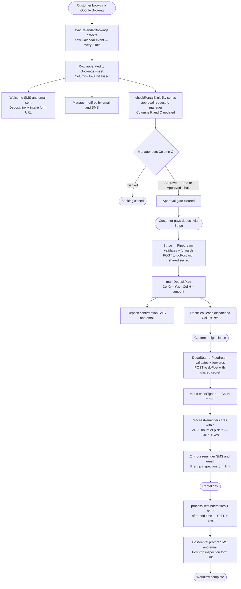

# Reliable Storage — Truck Rental Automation

> **Production system.** Automates the complete truck rental workflow for Reliable Storage across multiple locations and vehicle types — from calendar booking to post-rental inspection follow-up.

---

## Table of Contents

1. [Project Overview](#project-overview)
2. [Booking Workflow](#booking-workflow)
3. [Architecture](#architecture)
4. [Repository Structure](#repository-structure)
5. [External Integrations](#external-integrations)
6. [Configuration](#configuration)
7. [Sandbox Setup](#sandbox-setup)
8. [Deployment](#deployment)
9. [Testing](#testing)
10. [Adding a New Location](#adding-a-new-location)
11. [Adding a New Vehicle Type](#adding-a-new-vehicle-type)
12. [Development Workflow](#development-workflow)
13. [Troubleshooting](#troubleshooting)

---

## Project Overview

Reliable Storage is a Pacific Northwest storage and moving truck rental company with locations in Bainbridge, Poulsbo, Port Orchard, and Fairgrounds. This repository contains the Google Apps Script automation that handles every step of the truck rental process without manual staff intervention.

**What it does automatically:**

- Detects new calendar bookings and sends a welcome message with deposit and intake form links
- Notifies the site manager and requests their approval for each booking
- Sends a DocuSeal lease for e-signature after the deposit clears
- Sends a 24-hour pickup reminder with the pre-trip inspection form link
- Sends a post-rental inspection prompt after the rental ends

**Active sites:** Bainbridge (Cargo Van), Poulsbo (Moving Truck), Port Orchard (Moving Truck), Fairgrounds (Moving Truck).

**Tech stack:** Google Apps Script (V8) · Google Calendar · Google Sheets · Stripe · DocuSeal · Twilio · SendGrid · Pipedream

**System of record:** Google Sheets (Bookings tab, columns A–S). All state lives in the sheet; the script holds no state between runs.

---

## Booking Workflow



**Implementation notes:**

- `syncCalendarBookings` extracts customer name, email, phone, and second driver email from the structured HTML in the Calendar event description — not from the event title
- Column O (`Rental Approved`) is enforced by a data-validation dropdown with exactly three permitted values; the script never writes to this column
- Deposit and approval can arrive in either order. `markDepositPaid` sends the lease immediately on payment regardless of approval status. `sendLeaseToNewBookings` is a catch-up engine for the case where payment cleared before the lease was sent (e.g., approval arrived after deposit)
- The 24-hour reminder fires when `hoursUntilStart` is between 0 and 26, covering the 30-minute trigger interval; it only fires for approved bookings
- Post-rental prompt fires 1 hour after end time; end time defaults to start + 4 hours if the Calendar event has no end time set
- The manager is automatically BCC'd on every customer-facing email; emails already addressed to the manager or admin are excluded from the BCC

---

## Architecture

Two independent execution paths converge on Google Sheets as the shared system of record.

The **trigger path** runs on time-based schedules inside Google Apps Script. It polls Google Calendar for new bookings, processes each sheet row, and dispatches outbound communications.

The **webhook path** is event-driven. Stripe and DocuSeal post events to Pipedream, which validates upstream signatures, normalises payloads, injects the shared secret, and forwards to the Apps Script web app endpoint.


### Multi-site design

Multiple locations and vehicle types are driven by `CALENDAR_CONFIGS` in `Config.js` — the single source of truth for which calendars to poll, which location they belong to, and which vehicle type they serve:

```javascript
const CALENDAR_CONFIGS = [
  { propKey: 'CALENDAR_ID_BAINBRIDGE_CARGO_VAN',      calendarId: PROPS.CALENDAR_ID_BAINBRIDGE_CARGO_VAN,      location: 'Bainbridge',   vehicleType: 'Cargo Van' },
  { propKey: 'CALENDAR_ID_POULSBO_MOVING_TRUCK',      calendarId: PROPS.CALENDAR_ID_POULSBO_MOVING_TRUCK,      location: 'Poulsbo',      vehicleType: 'Moving Truck' },
  { propKey: 'CALENDAR_ID_PORT_ORCHARD_MOVING_TRUCK', calendarId: PROPS.CALENDAR_ID_PORT_ORCHARD_MOVING_TRUCK, location: 'Port Orchard', vehicleType: 'Moving Truck' },
  { propKey: 'CALENDAR_ID_FAIRGROUNDS_MOVING_TRUCK',  calendarId: PROPS.CALENDAR_ID_FAIRGROUNDS_MOVING_TRUCK,  location: 'Fairgrounds',  vehicleType: 'Moving Truck' },
];
```

`syncCalendarBookings` iterates every entry in one pass. Entries whose `calendarId` Script Property is unset are silently skipped. Each booking row records its location and vehicle type in columns S and R, which drive per-vehicle deposit amounts and Stripe payment URLs downstream. `setupSheetSchema()` derives the column R and S dropdown validation lists directly from `CALENDAR_CONFIGS`, so adding a new entry automatically extends both dropdowns.

**Vehicle type resolution:** deposit amounts and Stripe URLs are looked up by vehicle type string in `getDepositAmount()` and `getStripePaymentUrl()` in `Helpers.js`. These functions contain explicit lookup tables — adding a new vehicle type requires updating both functions in addition to `CALENDAR_CONFIGS` and Config.js. See [Adding a New Vehicle Type](#adding-a-new-vehicle-type).

### Security model

**Shared-secret webhook authentication:** The Apps Script web app is deployed with "Anyone" access (required for Pipedream). Every `doPost` call validates `data.secret` against `WEBHOOK_SHARED_SECRET` in Script Properties before reading any sheet data or sending any message. Requests with a missing or wrong secret return `{ received: false }` immediately with HTTP 200 (non-200 would trigger Pipedream retry loops).

**Idempotent flag writes:** Every outbound message type has a sentinel flag in the sheet (columns G–N). The flag is written and flushed to the spreadsheet *before* the external API call. A concurrent trigger invocation that re-fires mid-execution sees the flag as set and skips the row, preventing duplicate messages.

**Column O is manager-only:** The script never writes to column O (`Rental Approved`). Only the site manager sets it, using a data-validation dropdown restricted to `Approved - Free`, `Approved - Paid`, or `Denied`.

**Credentials in Script Properties:** No API key, webhook secret, calendar ID, or form URL appears in source code. All are loaded from Script Properties at runtime. Rotating a credential requires one update in the Apps Script console.

### Approval reminder state machine

`checkRentalEligibility` runs every 5 minutes and drives a four-branch state machine tracked in columns P (last notification timestamp) and Q (reminder count):

| Q value | Condition | Action |
|---|---|---|
| 0 | intake sent, O blank | Send initial approval email to manager. Set P = now, Q = 1 |
| 1 or 2 | hours since P ≥ 12 | Send reminder. Set P = now, Q = Q + 1 |
| 3 | hours since P ≥ 12 | Escalate to ADMIN_EMAIL. Set Q = 4 (permanent skip) |
| > 3 | — | Skip silently forever |

The script never writes to column O. Only the manager resolves the booking.

---

## Repository Structure

```
src/                          ← working copy — paste each file into Apps Script
  Config.js                   ← PROPS, CONFIG, CALENDAR_CONFIGS
  CalendarSync.js             ← syncCalendarBookings() — Engine 1
  Leases.js                   ← sendLeaseToNewBookings() — Engine 2 (catch-up)
  Approval.js                 ← checkRentalEligibility() — Engine 2b
  Reminders.js                ← processReminders() — Engine 3
  Notifications.js            ← sendSms(), sendEmailHtml(), alertAdmin()
  DocuSeal.js                 ← sendLeaseViaDocuSeal()
  Webhooks.js                 ← doPost(), doGet(), markDepositPaid(), markLeaseSigned()
  Forms.js                    ← buildIntakeUrl(), buildInspectUrl()
  Helpers.js                  ← getSheet(), extraction helpers, formatters,
                                 getDepositAmount(), getStripePaymentUrl()
  Setup.js                    ← setupTriggers(), setupSheetSchema()
  SandboxTests.js             ← manual test functions — never wire to triggers

archive/
  v7-original.js              ← unmodified v7 source — never edit

docs/
  setup-notes.md              ← Script Properties reference, sheet schema,
                                 trigger setup, Pipedream workflow config
  testing-plan.md             ← step-by-step flow test checklist
  sandbox-plan.md             ← sandbox environment setup notes
  architecture-proposal.md    ← historical design notes
  production-diff-summary.md  ← v7 → v8 change analysis

CLAUDE.md                     ← context for AI-assisted development
README.md                     ← this file
```

**All 12 `src/*.js` files share one global scope** when deployed to Apps Script. There is no module system, no imports, no exports. Functions in one file call functions in another freely. Load order between files is irrelevant — no file has top-level code that depends on another file's declarations at parse time. `PROPS`, `CONFIG`, and `CALENDAR_CONFIGS` are declared in `Config.js` and referenced inside function bodies elsewhere.

---

## External Integrations

### Google Calendar

Customer bookings arrive via Google Booking as Calendar events. `syncCalendarBookings` polls each calendar in `CALENDAR_CONFIGS` every 5 minutes. Customer name, email, phone, and second driver email are extracted from the HTML event description using regex helpers in `Helpers.js`.

**Config keys:** `CALENDAR_ID_BAINBRIDGE_CARGO_VAN`, `CALENDAR_ID_POULSBO_MOVING_TRUCK`, `CALENDAR_ID_PORT_ORCHARD_MOVING_TRUCK`, `CALENDAR_ID_FAIRGROUNDS_MOVING_TRUCK`

### Google Sheets

The Bookings tab is the system of record. One row per booking, columns A–S. State flags in columns G–N drive all idempotency. `getSheet()` in `Helpers.js` reads `SHEET_ID` from Script Properties and opens the spreadsheet by ID. The sheet tab must be named `Bookings` exactly.

**Config key:** `SHEET_ID`

### Google Forms

Two Google Forms receive pre-filled URLs generated by the script:
- **Intake form** — sent in the welcome message with name, email, phone, and rental date pre-filled
- **Inspection form** — sent in the 24-hour reminder (pre-trip) and the post-rental prompt (post-trip) with name, email, date, and inspection type pre-filled

Form base URLs and entry IDs are stored in Script Properties. The inspection type field uses configurable option text stored as `INSPECT_VAL_PRE` and `INSPECT_VAL_POST`.

**Config keys:** `INTAKE_FORM_BASE`, `INTAKE_ENTRY_NAME`, `INTAKE_ENTRY_EMAIL`, `INTAKE_ENTRY_PHONE`, `INTAKE_ENTRY_DATE`, `INSPECT_FORM_BASE`, `INSPECT_ENTRY_NAME`, `INSPECT_ENTRY_EMAIL`, `INSPECT_ENTRY_DATE`, `INSPECT_ENTRY_TYPE`, `INSPECT_VAL_PRE`, `INSPECT_VAL_POST`

### Stripe

Customers pay deposits via public Stripe Payment Links. Per-vehicle URLs are stored in Script Properties and resolved by `getStripePaymentUrl(vehicleType)` in `Helpers.js`. After payment, Stripe sends a webhook event to Pipedream, which forwards it to `doPost`.

**Config keys:** `STRIPE_PAYMENT_URL_CARGO_VAN`, `STRIPE_PAYMENT_URL_MOVING_TRUCK`, `STRIPE_PAYMENT_URL` (fallback for rows with a blank vehicle type)

### DocuSeal

Rental agreements are sent for e-signature via the DocuSeal API. `sendLeaseViaDocuSeal` in `DocuSeal.js` creates a submission with a configured template, sends the signing request to the customer (and second driver if present), and adds the site manager as a co-signer. Role names in the DocuSeal template must match exactly:

- Single driver: `Driver`, `Reliable Storage Manager`
- Two drivers: `Driver #1`, `Driver #2`, `Reliable Storage Manager`

After all parties sign, DocuSeal sends a webhook to Pipedream, which forwards a `lease_signed` event to `doPost`, which calls `markLeaseSigned`.

**Config keys:** `DOCUSEAL_KEY`, `DOCUSEAL_TEMPLATE_SINGLE`, `DOCUSEAL_TEMPLATE_TWO_DRIVERS`

### SendGrid

All HTML emails go through the SendGrid API (`sendEmailHtml` in `Notifications.js`). The site manager is automatically BCC'd on every customer-facing email. Emails already addressed to the manager or admin are excluded from the BCC to avoid duplicate copies.

**Config keys:** `SENDGRID_KEY`, `FROM_EMAIL`, `REPLY_TO_EMAIL`

### Twilio

SMS messages go through the Twilio REST API (`sendSms` in `Notifications.js`). All messages send from `TWILIO_NUM`, so the manager can see every customer thread in the Twilio App without any separate copy being sent (Twilio also rejects messages where `To` equals `From`).

**Config keys:** `TWILIO_SID`, `TWILIO_TOKEN`, `TWILIO_NUM`

### Pipedream

Pipedream sits between Stripe/DocuSeal and Apps Script. It validates upstream signatures, filters to the relevant event types, extracts the fields Apps Script needs, injects the `WEBHOOK_SHARED_SECRET`, and POSTs a minimal consistent payload to the Apps Script web app endpoint.

**Do not** register the Apps Script URL directly with Stripe or DocuSeal — always route through Pipedream. If a provider changes their event envelope, only the Pipedream workflow needs updating.

**Stripe Pipedream workflow POSTs:**
```json
{ "secret": "...", "customerEmail": "...", "amountPaid": "..." }
```

**DocuSeal Pipedream workflow POSTs:**
```json
{ "secret": "...", "type": "lease_signed", "signerEmail": "..." }
```

---

## Configuration

### How configuration works

`Config.js` loads all Script Properties once at startup into `PROPS`, then binds them into `CONFIG`:

```javascript
const PROPS = PropertiesService.getScriptProperties().getProperties();

const CONFIG = {
  SHEET_NAME: 'Bookings',           // program constant — not a Script Property
  ADMIN_EMAIL: PROPS.ADMIN_EMAIL,   // from Script Properties
  // ...
};
```

**Program constants** (hardcoded in `Config.js`, not Script Properties): `SHEET_NAME`, `FROM_NAME`, `DAYS_AHEAD`, `POST_RENTAL_HOURS`, `HOURS_BETWEEN_APPROVAL_REMINDERS`, `MAX_APPROVAL_REMINDERS`. These are operational parameters that belong in code, not configuration.

**Everything else** is a Script Property. No API key, webhook secret, phone number, email address, form URL, or calendar ID belongs in source code. To rotate a credential, update the value in the Apps Script console — no code change, no redeployment.

### Complete Script Properties table

See [`docs/setup-notes.md`](docs/setup-notes.md) for the full table with descriptions. Summary by service:

| Group | Properties |
|---|---|
| Identity | `SHEET_ID`, `ADMIN_EMAIL`, `MANAGER_EMAIL`, `MANAGER_PHONE` |
| Google Calendar | `CALENDAR_ID_BAINBRIDGE_CARGO_VAN`, `CALENDAR_ID_POULSBO_MOVING_TRUCK`, `CALENDAR_ID_PORT_ORCHARD_MOVING_TRUCK`, `CALENDAR_ID_FAIRGROUNDS_MOVING_TRUCK` |
| Stripe | `STRIPE_PAYMENT_URL_CARGO_VAN`, `STRIPE_PAYMENT_URL_MOVING_TRUCK`, `STRIPE_PAYMENT_URL` |
| Deposit amounts | `DEPOSIT_AMOUNT_CARGO_VAN`, `DEPOSIT_AMOUNT_MOVING_TRUCK`, `DEPOSIT_AMOUNT` |
| Twilio | `TWILIO_SID`, `TWILIO_TOKEN`, `TWILIO_NUM` |
| SendGrid | `SENDGRID_KEY`, `FROM_EMAIL`, `REPLY_TO_EMAIL` |
| DocuSeal | `DOCUSEAL_KEY`, `DOCUSEAL_TEMPLATE_SINGLE`, `DOCUSEAL_TEMPLATE_TWO_DRIVERS` |
| Intake Form | `INTAKE_FORM_BASE`, `INTAKE_ENTRY_NAME`, `INTAKE_ENTRY_EMAIL`, `INTAKE_ENTRY_PHONE`, `INTAKE_ENTRY_DATE` |
| Inspection Form | `INSPECT_FORM_BASE`, `INSPECT_ENTRY_NAME`, `INSPECT_ENTRY_EMAIL`, `INSPECT_ENTRY_DATE`, `INSPECT_ENTRY_TYPE`, `INSPECT_VAL_PRE`, `INSPECT_VAL_POST` |
| Webhooks | `WEBHOOK_SHARED_SECRET` |

---

## Sandbox Setup

A sandbox uses a separate Google Spreadsheet and Google Calendar, with a separate Apps Script project pointing at them.

**Minimum Script Properties for sandbox testing:**

- `SHEET_ID` — sandbox spreadsheet ID
- At least one `CALENDAR_ID_*` — a test calendar you control, shared with the script account
- `MANAGER_EMAIL`, `ADMIN_EMAIL` — your own addresses for test notifications
- `MANAGER_PHONE` — a real number you can receive SMS on (omit or leave blank to skip manager SMS)
- `TWILIO_SID`, `TWILIO_TOKEN`, `TWILIO_NUM` — Twilio credentials (test or live)
- `SENDGRID_KEY`, `FROM_EMAIL`, `REPLY_TO_EMAIL` — SendGrid credentials
- `DOCUSEAL_KEY`, `DOCUSEAL_TEMPLATE_SINGLE`, `DOCUSEAL_TEMPLATE_TWO_DRIVERS` — DocuSeal credentials
- `STRIPE_PAYMENT_URL_CARGO_VAN` or `_MOVING_TRUCK` — any URL; deposit links are not validated
- `DEPOSIT_AMOUNT_CARGO_VAN` or `_MOVING_TRUCK` — e.g. `50`
- All `INTAKE_*` and `INSPECT_*` properties — required for URL generation in welcome and reminder messages
- `WEBHOOK_SHARED_SECRET` — generate with `openssl rand -hex 32`

Properties for inactive sites are safely skipped. You only need to set properties for the calendars you're testing.

For webhook testing (deposit and lease signing events), use the curl commands in [`docs/setup-notes.md`](docs/setup-notes.md).

---

## Deployment

Full instructions are in [`docs/setup-notes.md`](docs/setup-notes.md). Summary:

1. Open the Google Sheet → **Extensions → Apps Script**
2. Create one script file per `src/*.js` file and paste its contents — all 12 files must be present
3. Set all Script Properties under **Project Settings → Script Properties**
4. Run `setupTriggers()` once from the editor toolbar — registers all 4 triggers and calls `setupSheetSchema()` to add column headers and dropdown validation
5. Deploy as a Web App: **Deploy → New deployment → Web app**; set *Execute as: Me*, *Who has access: Anyone*
6. Copy the deployment URL into each Pipedream workflow's final POST step

**Re-deployment note:** Apps Script generates a new deployment URL only when you create a new *versioned* deployment. Editing and saving source files without creating a new version preserves the existing URL. If you do create a new version, update the URL in both Pipedream workflows.

---

## Testing

Manual test functions live in `src/SandboxTests.js`. Run them from the Apps Script editor — select the function name in the dropdown and click Run. Never wire these to triggers.

| Function | What it tests |
|---|---|
| `testSheetConnection()` | SHEET_ID is set, Bookings tab is accessible |
| `testCalendarConfigs()` | Every CALENDAR_CONFIGS entry connects to a real calendar |
| `listAccessibleCalendars()` | Lists all calendars visible to the script account |
| `testBuildIntakeUrl()` | Intake URL generation (requires a "Test Customer" row in the sheet) |
| `testVehicleTypeAndLocationMapping()` | CALENDAR_CONFIGS entries match expected metadata |
| `testMissingCalendarConfig()` | Missing/invalid calendar IDs are handled gracefully |
| `testSyncCalendarBookingsNoNotifications()` | Full calendar sync without sending any notifications |
| `testStripePaymentUrls()` | Every vehicle type resolves to a non-empty Stripe payment URL |
| `testDepositAmounts()` | Every vehicle type resolves to a correct deposit amount |

For a full end-to-end flow test (calendar event → sheet row → deposit webhook → lease → reminder → post-rental), follow the checklist in [`docs/testing-plan.md`](docs/testing-plan.md).

---

## Adding a New Location

Adding a location that uses an existing vehicle type requires only configuration changes — no logic changes.

**Steps:**

1. **Share the calendar** with the Google account that owns the Apps Script project (Calendar Settings → Share with specific people)

2. **Add an entry to `CALENDAR_CONFIGS`** in `src/Config.js`:
   ```javascript
   {
     propKey:     'CALENDAR_ID_NEWTOWN_CARGO_VAN',
     calendarId:  PROPS.CALENDAR_ID_NEWTOWN_CARGO_VAN,
     location:    'Newtown',
     vehicleType: 'Cargo Van',
   },
   ```

3. **Set the Script Property** in Apps Script → Project Settings → Script Properties:
   - Key: `CALENDAR_ID_NEWTOWN_CARGO_VAN`
   - Value: the Google Calendar ID (found in Google Calendar → Settings → Integrate calendar → Calendar ID)

4. **Re-run `setupSheetSchema()`** (or `setupTriggers()`) to update the Location dropdown in column S

The next `syncCalendarBookings` run picks up events from the new calendar automatically. No engine code changes.

---

## Adding a New Vehicle Type

Adding a vehicle type that does not already exist requires changes in three source files.

**Steps:**

1. **Add an entry to `CALENDAR_CONFIGS`** in `src/Config.js` (same structure as adding a location, with the new `vehicleType` string)

2. **Add the vehicle type to the lookup tables** in `src/Helpers.js`:
   ```javascript
   function getDepositAmount(vehicleType) {
     const amounts = {
       'Cargo Van':    CONFIG.DEPOSIT_AMOUNT_CARGO_VAN,
       'Moving Truck': CONFIG.DEPOSIT_AMOUNT_MOVING_TRUCK,
       'Box Truck':    CONFIG.DEPOSIT_AMOUNT_BOX_TRUCK,    // ← add
     };
     ...
   }

   function getStripePaymentUrl(vehicleType) {
     const urls = {
       'Cargo Van':    CONFIG.STRIPE_PAYMENT_URL_CARGO_VAN,
       'Moving Truck': CONFIG.STRIPE_PAYMENT_URL_MOVING_TRUCK,
       'Box Truck':    CONFIG.STRIPE_PAYMENT_URL_BOX_TRUCK, // ← add
     };
     ...
   }
   ```

3. **Add the corresponding CONFIG entries** in `src/Config.js`:
   ```javascript
   DEPOSIT_AMOUNT_BOX_TRUCK:    PROPS.DEPOSIT_AMOUNT_BOX_TRUCK    || '75',
   STRIPE_PAYMENT_URL_BOX_TRUCK: PROPS.STRIPE_PAYMENT_URL_BOX_TRUCK,
   ```

4. **Set the new Script Properties** in the Apps Script console:
   - `DEPOSIT_AMOUNT_BOX_TRUCK`
   - `STRIPE_PAYMENT_URL_BOX_TRUCK`
   - `CALENDAR_ID_<LOCATION>_BOX_TRUCK` (one per location using this vehicle type)

5. **Re-run `setupSheetSchema()`** to update the Vehicle Type dropdown in column R

---

## Development Workflow

This project runs entirely inside Google Apps Script. There is no local execution environment — code must be deployed to Apps Script to run.

**Editing source files:**

Edit files in `src/` using your preferred editor. To deploy changes, paste the updated file's contents into the matching script file in the Apps Script editor and save. Or use [clasp](https://github.com/google/clasp) to push all `src/*.js` files at once.

Changes to trigger-path functions (anything called by `syncCalendarBookings`, `checkRentalEligibility`, `sendLeaseToNewBookings`, or `processReminders`) take effect immediately after saving in the editor — no new deployment needed.

Changes to `doPost` (the webhook path) require a new versioned deployment to take effect.

**Testing a change:**

1. Deploy the changed file(s) to Apps Script
2. Run the relevant test function from `SandboxTests.js` in the editor
3. For workflow changes, add a test row to the sandbox sheet and run the engine function manually (e.g. select `syncCalendarBookings` and click Run)

**Viewing logs:**

Apps Script Editor → **Executions** (left sidebar). Each trigger run and manual execution has an entry with its `Logger.log()` output.

---

## Troubleshooting

### No new rows are being added from a calendar

1. Run `testCalendarConfigs()` — confirms each calendar Script Property is set and the calendar is accessible from the script account
2. Run `listAccessibleCalendars()` — confirms the target calendar is visible to the script account; if it doesn't appear, the calendar needs to be shared with the account
3. Check the Executions log for `syncCalendarBookings` — look for `skipping` (unset property) or `calendar not found` log lines

### A customer received a duplicate message

The flag-before-send pattern prevents most duplicates. Duplicates can happen if a flag column was manually cleared in the sheet, or if two trigger invocations started within the same flush window. Check the Executions log for two `syncCalendarBookings` or `processReminders` runs overlapping by a few seconds.

### A webhook POST arrived but nothing happened

1. Check the Executions log for `doPost` — look for `doPost rejected: missing or invalid secret`
2. Verify `WEBHOOK_SHARED_SECRET` is set and matches the value in each Pipedream workflow's POST step
3. Verify the Pipedream workflow is posting to the current Apps Script web app deployment URL (not a stale URL from a previous deployment)

### Approval reminders are not sending

1. Confirm column I (Intake Sent) = `Yes` for the row — `checkRentalEligibility` skips rows where intake has not been sent
2. Confirm column O (Rental Approved) is blank — rows with any of the three decision values are skipped
3. Check column Q (Approval Reminder Count) — if it is > `MAX_APPROVAL_REMINDERS` (3), the row has been permanently silenced after escalation to admin

### The DocuSeal lease is not sending

1. Confirm `DOCUSEAL_KEY`, `DOCUSEAL_TEMPLATE_SINGLE`, and `DOCUSEAL_TEMPLATE_TWO_DRIVERS` are set correctly
2. Verify the DocuSeal template role names match exactly: `Driver` / `Reliable Storage Manager` (single driver), `Driver #1` / `Driver #2` / `Reliable Storage Manager` (two drivers)
3. Check the Executions log for DocuSeal error messages from `sendLeaseViaDocuSeal`

### The 24-hour reminder did not fire

1. Confirm column O (Rental Approved) is `Approved - Free` or `Approved - Paid` — the reminder only fires for approved bookings
2. Confirm column K (24hr Sent) is blank — a `Yes` value means it already fired
3. Check the Executions log for `processReminders` runs around 26–24 hours before the booking start time
